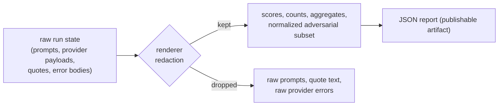

The JSON report is a **public contract**. A dashboard, a CI script, or the report
API wires into it once and relies on it not breaking. This page is that contract
and the rules that keep it stable.

## Versioning

Every report payload carries two explicit version discriminators:

- **`schema_version`** — `eval-harness.report.v1`, the shape of the report
  envelope.
- **`dataset_schema_version`** — the dataset contract the run scored against
  (`eval-harness.dataset.v1`).

The report API responses add their own `eval-harness.api.v1` envelope version.
These let consumers branch on version and evolve safely.

## The stability rule

> Schemas evolve **additively**. New fields may be added; existing fields keep
> their meaning within a major version.

That is what makes "wire it once" safe: a consumer reading `macro_f1` today will
still find `macro_f1` with the same semantics after additive releases. Removals or
semantic changes require a major version bump. See
[`docs/CONTRACT_STABILITY.md`](https://github.com/padosoft/eval-harness/blob/main/docs/CONTRACT_STABILITY.md).

## The report shape

```json
{
  "schema_version": "eval-harness.report.v1",
  "dataset_schema_version": "eval-harness.dataset.v1",
  "dataset": "rag.factuality.fy2026",
  "macro_f1": 0.8500,
  "total_samples": 30,
  "total_failures": 0,
  "duration_seconds": 2.41,
  "metrics": {
    "exact-match":      { "mean": 0.7333, "p50": 1.0, "p95": 1.0, "pass_rate": 0.7333 },
    "cosine-embedding": { "mean": 0.9012, "p50": 0.9421, "p95": 0.9893, "pass_rate": 0.9667 }
  },
  "cohorts": [
    { "cohort": "geography", "samples": 12, "metric": "exact-match",
      "mean": 0.95, "p50": 1.0, "p95": 1.0, "pass_rate": 0.95 }
  ],
  "histograms": {
    "exact-match": [ { "range": "0.0-0.1", "count": 8 }, { "range": "0.9-1.0", "count": 22 } ]
  },
  "usage": {
    "prompt_tokens":     { "total": 3600, "reported": 30 },
    "completion_tokens": { "total": 1200, "reported": 30 },
    "total_tokens":      { "total": 4800, "reported": 30 },
    "cost_usd":          { "total": 0.0720, "reported": 30 },
    "latency_ms":        { "total": 25500, "reported": 30 }
  },
  "rows": [
    { "sample_id": "capital-france", "tags": ["geography", "easy"],
      "metric": "exact-match", "score": 1.0, "error": null, "details": {} }
  ]
}
```

## The blocks

<AccordionGroup>
  <Accordion title="Top-level aggregates">
    `macro_f1`, `total_samples`, `total_failures`, `duration_seconds` — the
    headline numbers a gate reads. `macro_f1` is the mean pass-rate across metrics.
  </Accordion>
  <Accordion title="metrics">
    Per-metric `mean`, `p50`, `p95`, `pass_rate`. Pass-rate counts scores
    `>= 0.5`. Percentiles expose tails the mean hides.
  </Accordion>
  <Accordion title="cohorts">
    The same aggregates sliced by `metadata.tags`, with an explicit untagged
    bucket. Multi-tag samples appear in each cohort.
  </Accordion>
  <Accordion title="histograms">
    Per-metric distribution over ten `[0,1]` buckets, zero-count buckets included
    — for charting distribution shape, not just central tendency.
  </Accordion>
  <Accordion title="usage">
    Aggregated token / cost / latency, each with a `reported` count so a consumer
    distinguishes "not reported" from a reported zero. Usage attached to captured
    failures is still counted, so malformed responses never hide spend. Raw
    prompts and provider payloads are never included.
  </Accordion>
  <Accordion title="rows">
    Per-`(sample, metric)` rows: `sample_id`, `tags`, `metric`, `score`, `error`,
    and `details`. The `details` for sensitive metrics (citation evidence) expose
    counts only — never raw quotes or citation strings.
  </Accordion>
  <Accordion title="adversarial (when present)">
    A safe normalized block: category, label, severity, and compliance-framework
    counts (OWASP LLM / NIST AI RMF / EU AI Act). Raw prompts and refusal-policy
    text are excluded by design.
  </Accordion>
</AccordionGroup>

## Safety of the contract



The renderer is the trust boundary: it emits scores, counts, and aggregates, and
withholds raw prompts, quote text, and provider error bodies. That is what makes
a report safe to upload as a CI artifact or serve through the report API.

## Consuming it

- **CI** — `jq '.macro_f1' report.json` for a quality floor; `.cohorts` for
  per-slice gates.
- **Diffing** — the report API computes signed deltas between two reports; see
  [Report API](/reference/report-api).
- **Dashboards** — `metrics`, `cohorts`, `histograms`, and `usage` map directly
  to charts.

<CardGroup cols={2}>
  <Card title="Report API" icon="plug" href="/reference/report-api">
    The read-only endpoints that serve this contract.
  </Card>
  <Card title="Aggregation & macro-F1" icon="sigma" href="/metrics/ordinal-and-aggregation">
    How the aggregate numbers are computed.
  </Card>
</CardGroup>
