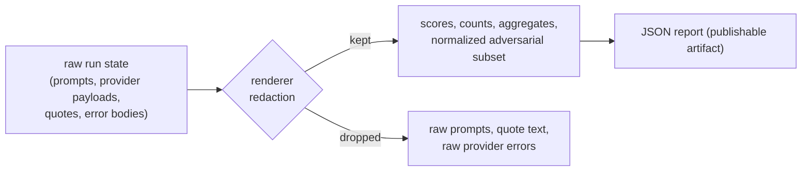

The JSON report is a **public contract**. A dashboard, a CI script, or the report
API wires into it once and relies on it not breaking. This page is that contract
and the rules that keep it stable.

## Versioning

Every report payload carries two explicit version discriminators:

- **`schema_version`** — `eval-harness.report.v1`, the shape of the report
  envelope.
- **`dataset_schema_version`** — the dataset contract the run scored against
  (`eval-harness.dataset.v1`).

The report API responses add their own `eval-harness.report-api.v1` envelope
version (per-endpoint sub-schemas extend it, e.g.
`eval-harness.report-api.v1.trend`).
These let consumers branch on version and evolve safely.

## The stability rule

> Schemas evolve **additively**. New fields may be added; existing fields keep
> their meaning within a major version.

That is what makes "wire it once" safe: a consumer reading `macro_f1` today will
still find `macro_f1` with the same semantics after additive releases. Removals or
semantic changes require a major version bump. See
[`docs/CONTRACT_STABILITY.md`](https://github.com/padosoft/eval-harness/blob/main/docs/CONTRACT_STABILITY.md).

## The report shape

```json
{
  "schema_version": "eval-harness.report.v1",
  "dataset_schema_version": "eval-harness.dataset.v1",
  "dataset": "rag.factuality.fy2026",
  "started_at": 1714600000.123,
  "finished_at": 1714600002.456,
  "duration_seconds": 2.41,
  "total_samples": 30,
  "total_failures": 0,
  "metrics": {
    "exact-match":      { "mean": 0.7333, "p50": 1.0, "p95": 1.0, "pass_rate": 0.7333 },
    "cosine-embedding": { "mean": 0.9012, "p50": 0.9421, "p95": 0.9893, "pass_rate": 0.9667 }
  },
  "metric_distributions": {
    "exact-match": [ { "min": 0.0, "max": 0.1, "count": 8 }, { "min": 0.9, "max": 1.0, "count": 22 } ]
  },
  "usage": {
    "observations": 30,
    "prompt_tokens": 3600,
    "completion_tokens": 1200,
    "total_tokens": 4800,
    "cost_usd": 0.0720,
    "reported": { "prompt_tokens": 30, "completion_tokens": 30, "total_tokens": 30, "cost_usd": 30, "latency_ms": 30 },
    "latency_ms": { "count": 30, "total": 25500.0, "mean": 850.0, "max": 1200.0 }
  },
  "cohorts": [
    { "name": "geography", "label": "geography", "is_untagged": false, "sample_count": 12,
      "metrics": { "exact-match": { "mean": 0.95, "p50": 1.0, "p95": 1.0, "pass_rate": 0.95 } } },
    { "name": null, "label": "(untagged)", "is_untagged": true, "sample_count": 3, "metrics": { } }
  ],
  "adversarial": null,
  "macro_f1": 0.8500,
  "samples": [
    { "id": "capital-france", "tags": ["geography", "easy"], "adversarial": null,
      "actual_output": "Paris",
      "scores": { "exact-match": { "score": 1.0, "details": { } } } }
  ],
  "failures": [
    { "sample_id": "timeout-47", "metric": "llm-as-judge", "error": "Judge request timed out after 60s." }
  ]
}
```

## The blocks

<AccordionGroup>
  <Accordion title="Top-level aggregates">
    `macro_f1`, `total_samples`, `total_failures`, `started_at` / `finished_at` /
    `duration_seconds` — the headline numbers a gate reads. `macro_f1` is the mean
    pass-rate across metrics.
  </Accordion>
  <Accordion title="metrics">
    A map of metric name → `{ mean, p50, p95, pass_rate }`. Pass-rate counts
    scores `>= 0.5`. Percentiles expose tails the mean hides.
  </Accordion>
  <Accordion title="metric_distributions">
    A map of metric name → an array of buckets, each `{ min, max, count }` over
    the `[0, 1]` range (zero-count buckets included) — for charting distribution
    shape, not just central tendency.
  </Accordion>
  <Accordion title="usage">
    Flat aggregated totals (`observations`, `prompt_tokens`, `completion_tokens`,
    `total_tokens`, `cost_usd`) plus a `reported` map of per-field counts (so a
    consumer distinguishes "not reported" from a reported zero) and a `latency_ms`
    object (`count` / `total` / `mean` / `max`). Usage attached to captured
    failures is still counted, so malformed responses never hide spend. Raw
    prompts and provider payloads are never included.
  </Accordion>
  <Accordion title="cohorts">
    An array of cohorts sliced by `metadata.tags`, each
    `{ name, label, is_untagged, sample_count, metrics }` where `metrics` is the
    same per-metric aggregate map as the top level. The untagged bucket has
    `name: null` and `is_untagged: true`; multi-tag samples appear in each cohort.
  </Accordion>
  <Accordion title="samples">
    Per-sample rows: `{ id, tags, adversarial, actual_output, scores }`, where
    `scores` maps each metric to `{ score, details }`. The `details` for sensitive
    metrics (citation evidence) expose counts only — never raw quotes or citation
    strings.
  </Accordion>
  <Accordion title="failures">
    Captured metric exceptions as `{ sample_id, metric, error }` — the same events
    counted by `total_failures` and reflected in the exit code.
  </Accordion>
  <Accordion title="adversarial (null unless an adversarial run)">
    `null` for a normal run. For the adversarial lane: a safe normalized block of
    `total_samples`, `categories` (each `{ category, label, severity, sample_count,
    compliance_frameworks, metrics }`), and `compliance_frameworks` counts (OWASP
    LLM / NIST AI RMF / EU AI Act). Raw prompts and refusal-policy text are
    excluded by design.
  </Accordion>
</AccordionGroup>

## Safety of the contract



The renderer is the trust boundary: it emits scores, counts, and aggregates, and
withholds raw prompts, quote text, and provider error bodies. That is what makes
a report safe to upload as a CI artifact or serve through the report API.

## Consuming it

- **CI** — `jq '.macro_f1' report.json` for a quality floor; `.cohorts` for
  per-slice gates.
- **Diffing** — the report API computes signed deltas between two reports; see
  [Report API](/reference/report-api).
- **Dashboards** — `metrics`, `cohorts`, `histograms`, and `usage` map directly
  to charts.

<CardGroup cols={2}>
  <Card title="Report API" icon="plug" href="/reference/report-api">
    The read-only endpoints that serve this contract.
  </Card>
  <Card title="Aggregation & macro-F1" icon="sigma" href="/metrics/ordinal-and-aggregation">
    How the aggregate numbers are computed.
  </Card>
</CardGroup>
