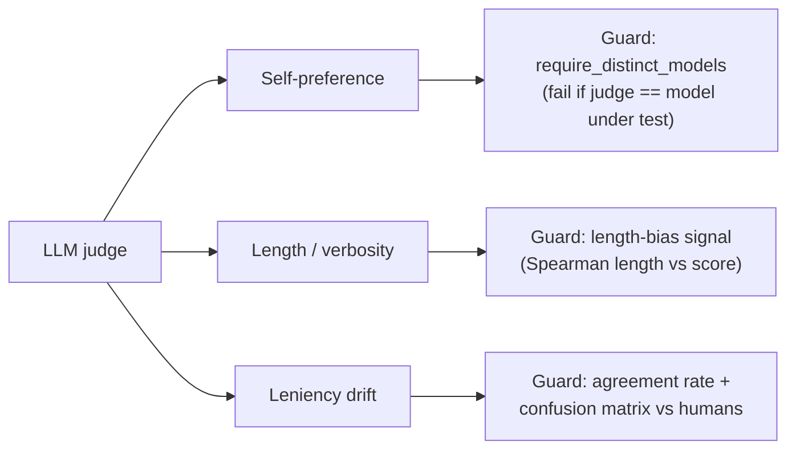

LLM-as-judge is powerful and dangerous in equal measure: a judge that disagrees
with your humans will confidently corrupt every gate it touches. This page is the
discipline that keeps a judge trustworthy in production.

## The cardinal rule

> **Never gate CI on an uncalibrated judge.**

Before a judge model grades anything that blocks a merge, prove it agrees with
human labels via [`eval-harness:calibrate-judge`](/guides/judge-calibration), and
require a minimum agreement floor. An uncalibrated judge is not a measurement —
it is a guess wearing a number.

## Defend against the three biases

<AccordionGroup>
  <Accordion title="Self-preference — never let a model grade itself">
    Keep `require_distinct_models` on. If your SUT runs `gpt-4o`, judge with a
    *different* model. The calibration command fails closed on a self-preference
    violation precisely because this bias is both strong and easy to introduce by
    accident.
  </Accordion>
  <Accordion title="Length bias — watch the verbosity correlation">
    If calibration warns that score correlates with answer length, your judge may
    be rewarding padding. Tighten the rubric in the prompt template to score
    correctness explicitly, and re-calibrate. A length-biased judge is gameable.
  </Accordion>
  <Accordion title="Leniency drift — read the confusion matrix, not just the rate">
    An 85% agreement rate hides whether the 15% disagreements are false-passes
    (regressions sneak through) or false-fails (good changes blocked). The
    confusion matrix tells you which, and which way to tune the
    `verdict_pass_threshold`.
  </Accordion>
</AccordionGroup>

## Pin determinism

The built-in judge already fixes `temperature = 0`, `seed = 42`, and
`response_format = json_object`, and rejects malformed JSON as a loud failure
rather than a silent `0.0`. Preserve that:

- Don't override the judge to a sampling temperature for "diversity" — a gate
  needs reproducibility, not creativity.
- Keep the **same judge model and prompt template** across a baseline window. A
  judge swap is a measurement-instrument change and invalidates comparisons to
  prior runs.

## Re-calibrate on every judge change

Treat the judge model and its prompt template as **versioned dependencies**:

<Steps>
  <Step title="Change the judge model or prompt">
    e.g. moving from `gpt-4o-mini` to a cheaper model, or editing the rubric.
  </Step>
  <Step title="Re-run calibration">
    `eval-harness:calibrate-judge` against your human-labelled cases, with the
    same `--min-agreement` floor.
  </Step>
  <Step title="Reset baselines if the judge changed">
    A different judge is a different instrument. Start a fresh baseline rather
    than comparing scores across judge versions.
  </Step>
</Steps>

## Prefer the cheapest sufficient metric

A judge is the most expensive and most bias-prone metric. Reach for it **last**:

| If you can express correctness as… | use… |
| --- | --- |
| an exact token / id / date | `exact-match` |
| a substring or pattern | `contains` / `regex` |
| ordered-label proximity | `ordinal-distance` |
| token-overlap of prose | `rouge-l` |
| paraphrase-tolerant similarity | `cosine-embedding` |
| grounded citations | `citation-groundedness` |
| **genuinely subjective quality** | `llm-as-judge` |

Every sample a cheaper metric can score is a sample that costs nothing, never
drifts, and never needs calibration. Save the judge for the cases that truly
require judgment.

<CardGroup cols={2}>
  <Card title="Judge calibration" icon="ruler-combined" href="/guides/judge-calibration">
    The command and metrics behind this practice.
  </Card>
  <Card title="Metrics overview" icon="function" href="/metrics/overview">
    The cheaper metrics to reach for first.
  </Card>
</CardGroup>
