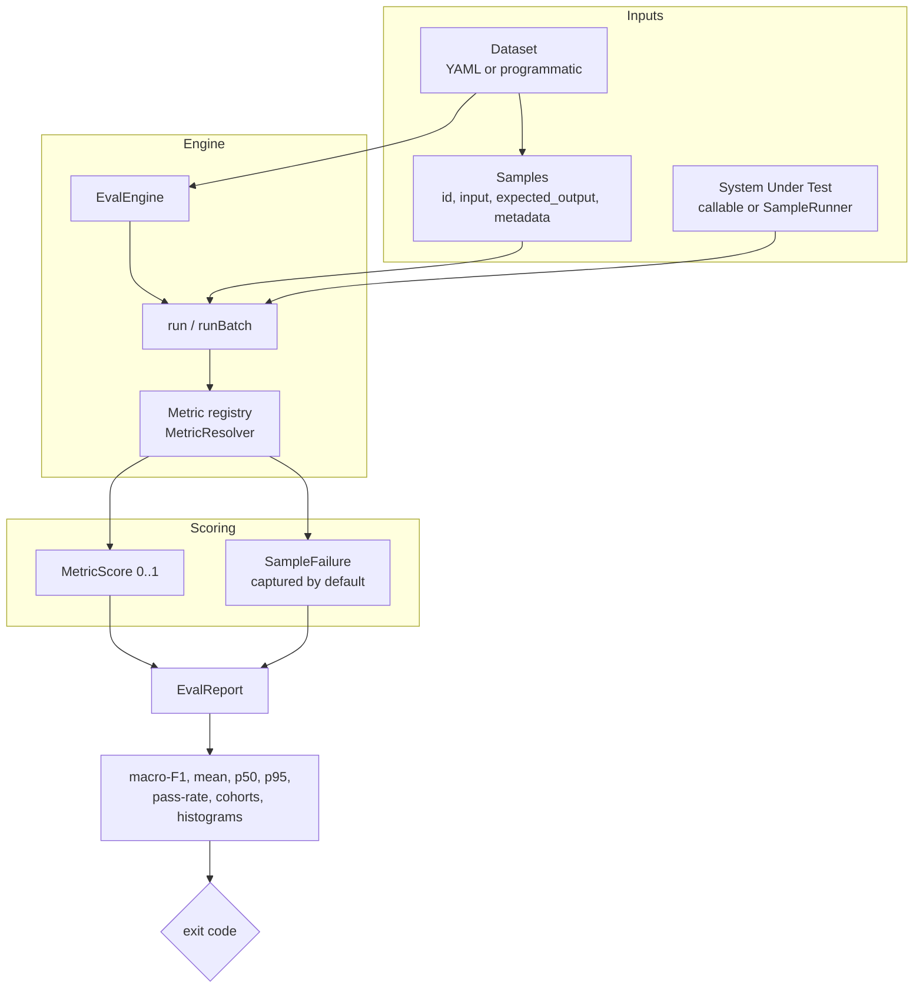

Everything in eval-harness composes from a handful of nouns. Learn these seven
and the rest of the documentation reads cleanly.

## Dataset

A **dataset** is a named collection of samples plus the metrics it is scored
with. Datasets are **YAML files** (`eval/golden/*.yml`) — reviewable in pull
requests, diffable across releases, and never stored in your database — or built
programmatically with `DatasetSample` objects. Each dataset carries a
`schema_version` (`eval-harness.dataset.v1`) so the loader can evolve additively.

## Sample

A **sample** is one evaluation case:

| field             | meaning                                                              |
| ----------------- | ------------------------------------------------------------------- |
| `id`              | Stable identifier — used to align outputs and to label report rows. |
| `input`           | The arguments handed to your SUT (e.g. `{question: "..."}`).         |
| `expected_output` | The ground truth — a string, a list of ids, or graded gains.        |
| `metadata`        | Tags (cohorts), per-sample knobs (`k`, `refusal_expected`), evidence spans. |

`metadata.tags` drive **cohort** breakdowns; `metadata.k` overrides the
retrieval cutoff for that sample; `metadata.refusal_expected` makes safety
behavior explicit for the refusal judge.

## System under test (SUT)

The **SUT** is the thing you are evaluating — your real RAG/LLM pipeline. You
provide it as a callable bound to `eval-harness.sut`, or as a
container-resolvable `SampleRunner` class. The engine hands each sample's
`input` to the SUT and captures its **actual output** (a string, or JSON for the
retrieval metrics). Running the SUT stays in your app; the package owns the
scoring math.

<Note>
  For queue-backed `lazy-parallel` execution the SUT must be a
  container-resolvable concrete `SampleRunner` class, because queued jobs carry
  only the runner class name. Closures and arbitrary callables remain
  serial-only. See [Batch execution](/operations/batch-execution).
</Note>

## Metric

A **metric** scores `(sample, actual output)` into a `MetricScore` — a number in
`[0, 1]` plus optional structured details (e.g. provider `usage`). Metrics
implement a single-method `Metric` interface, so adding your own is a class, not
a fork. The package ships **fifteen built-in metrics** across five families;
see [Metrics overview](/metrics/overview).

The **`MetricResolver`** accepts three forms:

1. A `Metric` instance — full control.
2. A fully-qualified class name — resolved through the container.
3. A built-in **alias** string — e.g. `exact-match`, `cosine-embedding`,
   `llm-as-judge`, `retrieval-ndcg-at-k`.

Every resolved class is asserted to implement `Metric`, so a typo fails with a
clear error instead of a runtime "method does not exist".

## Report

An **`EvalReport`** is the immutable result of a run. Two renderers consume it:
`JsonReportRenderer` (a stable, versioned payload with `schema_version` and
`dataset_schema_version`) and `MarkdownReportRenderer` (human-readable). A
report carries:

- **Per-metric aggregates** — mean, p50, p95, and pass-rate (`>= 0.5`).
- **Macro-F1** — the average pass-rate across all metrics; the headline number
  most teams gate on.
- **Cohorts** — the same aggregates sliced by `metadata.tags`, with an explicit
  untagged bucket.
- **Score histograms** — per-metric distribution buckets for dashboards.
- **Usage summaries** — aggregated token / cost / latency when metrics report
  them.
- **Captured failures** — see below.

## Failures as data

A timeout on sample 47 should not erase the macro-F1 across 200 valid samples.
By default every metric exception is recorded as a **`SampleFailure`** against
`(sample, metric)` and surfaced in the report — the operator investigates one
case instead of re-running a 30-minute suite. Strict CI lanes can opt into
`EVAL_HARNESS_RAISE_EXCEPTIONS=true` to abort on the first `MetricException`.

## The gate

The Artisan commands translate the report into an **exit code**: `0` when every
metric scored cleanly, non-zero on any captured failure (or, for the adversarial
lane, on a tripped `--regression-gate`). That single integer is what turns a
report into a **merge gate** in CI.

## How the nouns compose

<AccordionGroup>
  <Accordion title="A standard run">
    Registrar registers a dataset + metrics and binds the SUT →
    `eval-harness:run` resolves them → the engine scores every sample → an
    `EvalReport` is rendered → the exit code gates CI.
  </Accordion>
  <Accordion title="Scoring saved outputs (no SUT)">
    When another job already produced model responses, `--outputs=<path>` (or
    `EvalFacade::scoreOutputs()`) scores them directly against the same dataset and
    metrics — no `eval-harness.sut` binding required.
  </Accordion>
  <Accordion title="An eval set">
    Group several registered datasets into an `EvalSetDefinition` and run them in
    order behind one gate, with a resumable JSON manifest so completed datasets
    are skipped on a retry.
  </Accordion>
  <Accordion title="The adversarial lane">
    A factory builds red-team seeds across 10 categories; `eval-harness:adversarial`
    scores them with `refusal-quality`, adds compliance summaries, and can gate
    on a local run-history manifest.
  </Accordion>
</AccordionGroup>

## Where to go next

<CardGroup cols={3}>
  <Card title="Golden datasets" icon="seedling" href="/guides/golden-datasets">
    The full dataset and sample contract.
  </Card>
  <Card title="Metrics overview" icon="function" href="/metrics/overview">
    The five families and how to choose.
  </Card>
  <Card title="Architecture" icon="sitemap" href="/architecture/overview">
    How the engine, batches, and renderers fit together.
  </Card>
</CardGroup>
