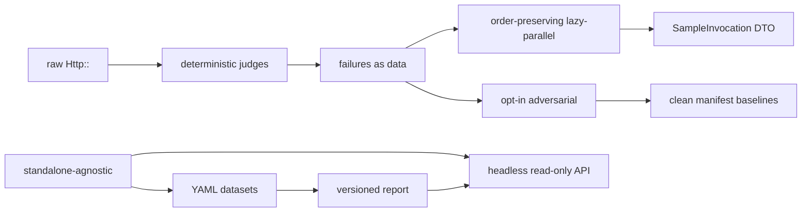

## Motivation

Code shows *what* the system does; it rarely shows *why*. These are the
load-bearing decisions that shaped eval-harness — each a problem, the choice
made, and the trade-off accepted. They are grouped into the arcs they belong to.
Do not unwind a non-obvious one without understanding what it holds up.

## The data arc: knowledge as reviewable, local-first state

  ::: collapsible "Datasets are YAML, never database rows"
**Problem.** Evaluation datasets must be reviewable, diffable, and survive
database wipes. A DB-backed dataset is invisible in a pull request and
couples evaluation to schema.

**Decision.** Golden datasets live in `eval/golden/*.yml` and load through a
strict-schema loader; the package never persists them. They are versioned
with your code and reviewed like code.

**Consequence.** No UI-driven dataset curation, and operators need YAML
fluency — accepted in exchange for PR-reviewable, diffable, durable datasets.
:::
  ::: collapsible "The report is human-readable and machine-versioned"
**Problem.** A report must serve both a human reading a PR and a dashboard
wiring in once.

**Decision.** Two renderers over one immutable `EvalReport` — Markdown for
humans, versioned JSON (`eval-harness.report.v1`) for machines — evolving
additively.

**Consequence.** Consumers branch on `schema_version` and trust fields not to
change meaning within a major. See [the report contract](/architecture/report-contract).
:::
  ::: collapsible "Minimal schema footprint — one auto-loaded migration"
**Problem.** A package that mutates the host schema on install is intrusive.

**Decision.** Datasets are YAML and results are JSON on a disk. The package
ships exactly **one** migration — `eval_harness_online_scores` for the
optional online-monitoring feature — auto-loaded by the service provider so it
is available to host apps and to `RefreshDatabase` in tests.

**Consequence.** `php artisan migrate` creates that single table; the feature
is off by default so it stays empty until you opt in, and no existing table is
touched.
:::

## The provider arc: control and testability over convenience

  ::: collapsible "Raw Http:: — no vendor AI SDKs"
**Problem.** Vendor SDKs hide auth, retries, timeouts, and response parsing,
and make deterministic offline tests hard.

**Decision.** Every embedding and judge call goes through Laravel's `Http::`
facade against an OpenAI-compatible endpoint. Tests substitute `Http::fake()`.

**Consequence.** Swapping providers is a config change, not a refactor, and
the whole external surface is fakeable — at the cost of managing endpoints and
auth yourself.
:::
  ::: collapsible "Deterministic judges, narrow retries"
**Problem.** A judge that varies run-to-run is useless as a gate; aggressive
retries can mask real failures.

**Decision.** The judge pins `temperature 0`, `seed 42`, `response_format=json_object`
and rejects malformed JSON loudly. Retries cover only connection failures,
429, and 5xx — never a malformed 200.

**Consequence.** Reproducible verdicts and a fail-closed posture on contract
violations.
:::

## The execution arc: failures as data, queues done safely

  ::: collapsible "Metric exceptions are captured by default"
**Problem.** A timeout on sample 47 should not erase the macro-F1 across 199
valid samples.

**Decision.** Every metric exception is recorded as a `SampleFailure` against
`(sample, metric)` and surfaced in the report. The exit code still reflects
it; strict lanes can opt into `raise_exceptions` to fail fast.

**Consequence.** Operators investigate one case instead of re-running a long
suite, while CI still fails on any captured failure.
:::
  ::: collapsible "Lazy-parallel preserves positional ordering"
**Problem.** Queue jobs finish out of order, but a report must be
deterministic and comparable.

**Decision.** Outputs are written to a cache-backed result store keyed by
batch id + sample index and reassembled in dataset order.

**Consequence.** A queue-backed run produces a report identical to a serial
one — at the cost of a shared cache store and Horizon sizing discipline.
:::
  ::: collapsible "A SampleInvocation DTO carries queue work"
**Problem.** A full `DatasetSample` may hold objects, resources, or invalid
UTF-8 that won't serialize onto a queue.

**Decision.** Jobs carry a minimal `SampleInvocation` (fields `id` + `input`
only); the worker hands just that to the runner and does **not** reconstruct
the full sample, so `expected_output` / `metadata` are unavailable in the
worker (scoring runs later in the producer against the original dataset).
Queued SUTs must therefore be container-resolvable `SampleRunner` classes that
need only `input`.

**Consequence.** No serialization failures and no contract creep — closures,
caller-specific runner state, and runners that need expected/metadata stay
serial-only.
:::

## The safety arc: opt-in red-teaming, clean baselines

  ::: collapsible "Adversarial coverage is opt-in"
**Problem.** A bundled red-team daemon is intrusive and hard to govern.

**Decision.** The adversarial lane is an explicit command with no background
process; you schedule it from Laravel Scheduler or CI cron.

**Consequence.** Full host control and transparency — at the cost of
remembering to schedule it.
:::
  ::: collapsible "Broken runs can never seed a baseline"
**Problem.** A drift gate is only sound if its baselines are clean; a
regression must not silently redefine "normal".

**Decision.** Manifest baselines advance only on failure-free, gate-clean
runs, keyed by report-schema / dataset / metric / category / sample-count.
Writes are lock-serialized and atomic.

**Consequence.** A `missing-baseline` status on fresh slices is expected and
correct; you cannot fake a baseline by hand without breaking the guarantee.
:::

## The boundary arc: headless and self-contained

  ::: collapsible "The report API is read-only and bundles no auth"
**Problem.** Shipping authentication in a library forces a security model on
every host.

**Decision.** The API is opt-in, read-only, and mounted behind the host app's
own middleware; it is disabled by default.

**Consequence.** Hosts wire their existing admin auth — the package never
leaks artifacts by default.
:::
  ::: collapsible "The package depends on none of its consumers"
**Problem.** Tooling extracted from an application tends to keep secret ties
back to it.

**Decision.** An architecture test walks `src/` and fails on any reference to a
consumer's internals or a sibling package.

**Consequence.** A genuinely reusable evaluation substrate — `composer require`
behaves identically with or without AskMyDocs or any sibling app.
:::

## How the arcs depend on each other

## Decision rationale (meta)

- **Why record decisions at all?** A wrong assumption baked into a quick fix
  propagates into every later PR. The durable *why* keeps future changes from
  unwinding deliberate constraints by accident.
- **Don't unwind a load-bearing choice silently.** The raw-`Http::` rule,
  failures-as-data, the queue-serializable SUT contract, clean-baseline-only
  manifests, and the standalone-agnostic guarantee each hold up something above
  them. The full editorial record lives in the repository's `docs/` — see
  [`CONTRACT_STABILITY.md`](https://github.com/padosoft/eval-harness/blob/main/docs/CONTRACT_STABILITY.md)
  and [`LESSON.md`](https://github.com/padosoft/eval-harness/blob/main/docs/LESSON.md).

::: grids
::: grid
::: card "Architecture overview" icon:network
The component map these decisions produced.

[Open →](/architecture/overview)
:::
:::
::: grid
::: card "The evaluation pipeline" icon:workflow
The run lifecycle, stage by stage.

[Open →](/architecture/evaluation-pipeline)
:::
:::
:::

