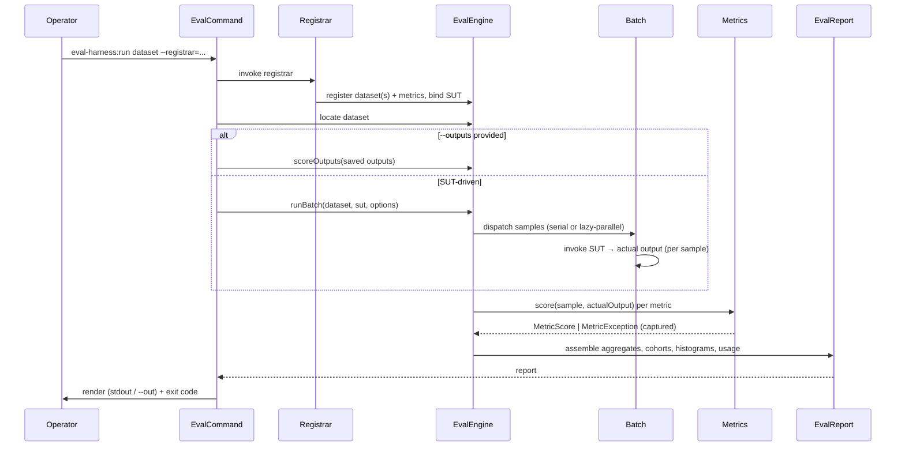
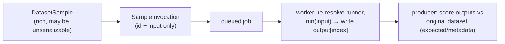

A run is a fixed pipeline from `php artisan` to an exit code. This page traces
every stage so you know exactly where each behavior lives.

## The full lifecycle

## Stage 1 — command entry & registrar

`EvalCommand` resolves and invokes the `--registrar`, which registers datasets +
metrics into the engine's **in-memory registry** and binds `eval-harness.sut`.
The command then locates the named dataset and decides the path: if `--outputs`
is set it routes straight to `scoreOutputs()` (the batch contract is bypassed
entirely); otherwise it resolves the SUT and calls `runBatch`.

## Stage 2 — batch dispatch

`EvalEngine::runBatch` chooses the batch from `BatchOptions`.

**SerialBatch (default).** Iterates samples in order, invoking the SUT inline and
collecting outputs positionally. Fully deterministic.

**LazyParallelBatch.** Dispatches one queue job per sample in chunks, applying
rate-limit and checkpoint policy, then collects outputs from a cache-backed
result store **keyed by batch id + sample index** — so order is preserved even
when jobs finish out of order. Covered in
[Batch execution](/operations/batch-execution) and
[Horizon & queues](/operations/horizon-and-queues).

### The SampleInvocation DTO

Queue jobs cannot carry a full `DatasetSample` — it may hold objects, resources,
or invalid-UTF-8 metadata that don't serialize. So a job carries a minimal
**`SampleInvocation`** DTO whose only public fields are `id` and `input`. The
worker resolves the runner and hands it **just that invocation** — it does **not**
reconstruct the full `DatasetSample`, so `expected_output` and `metadata` are
**not** available inside the worker. Scoring happens later, in the producer,
against the original in-memory dataset. This avoids serialization failures and
stops the queue contract from depending on arbitrary sample state.

::: callout warning
A queued `SampleRunner` receives only `id` and `input`. A runner that needs the
sample's `expected_output` or `metadata` at run time cannot get them on the
lazy-parallel path — keep that logic in the metric (which scores in the
producer with the full sample) or run such datasets serially.
:::

## Stage 3 — scoring with failure capture

For each `(sample, metric)` the engine calls `metric.score(sample, actualOutput)`:

- **Clean** → a `MetricScore` (scalar in `[0,1]` + optional `details`, e.g.
  provider `usage`).
- **Threw** → captured as a `SampleFailure` recording the exception type, message,
  and any provider usage — **unless** `runtime.raise_exceptions = true`, which
  aborts on the first `MetricException`.

Capturing by default is the deliberate invariant that keeps one bad sample from
erasing 199 good ones.

## Stage 4 — report assembly

`EvalReport` computes, in one pass:

- **Per-metric aggregates** — mean, p50, p95, pass-rate (`>= 0.5`).
- **Macro-F1** — the mean pass-rate across metrics.
- **Cohorts** — the same aggregates per `metadata.tags`, with an untagged bucket;
  multi-tag samples count in each cohort.
- **Histograms** — ten `[0,1]` buckets per metric, zero-count buckets included.
- **Usage** — aggregated token / cost / latency, with per-field "reported" counts
  so "not reported" is distinct from a reported zero; usage from captured failures
  is included so malformed responses don't hide spend.
- **Adversarial block** — a safe normalized subset (category, label, severity,
  frameworks) when present.

## Stage 5 — render & exit

Two renderers consume the report: `JsonReportRenderer` (stable, versioned —
`schema_version`, `dataset_schema_version`, per-sample rows, cohorts, histograms)
and `MarkdownReportRenderer` (human-readable tables). The command writes to stdout
or `--out`, then sets the **exit code** from `report.totalFailures()` — `0` clean,
non-zero otherwise.

## Key invariants

  ::: collapsible "Order preservation"
Lazy-parallel reassembles outputs in dataset order via an indexed result
store, so the report is identical to a serial run regardless of job
completion order.
:::
  ::: collapsible "Failures are data"
Metric exceptions are captured against `(sample, metric)` by default; strict
mode opts into fail-fast. Either way the exit code reflects them.
:::
  ::: collapsible "Determinism offline"
With faked embedding/judge clients and offline metrics, the whole pipeline is
network-free and reproducible — the judge additionally pins temp 0 / seed 42 /
json_object.
:::
  ::: collapsible "Narrow provider retries"
Retries cover only connection failures, 429, and 5xx — never a malformed 200,
which fails closed.
:::

::: grids
::: grid
::: card "Report contract" icon:file-code
The exact JSON the renderer emits.

[Open →](/architecture/report-contract)
:::
:::
::: grid
::: card "Architecture decisions" icon:scroll
Why the pipeline is shaped this way.

[Open →](/architecture/decisions)
:::
:::
:::

