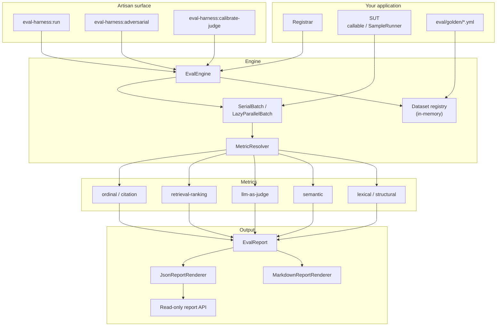
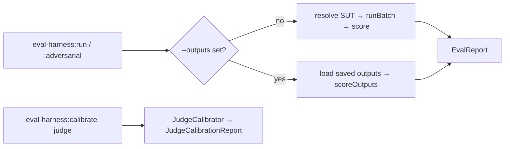

This is the map of the territory. It shows how the pieces fit, where the boundary
between your app and the package falls, and why the system is shaped this way.
Each subsystem has its own deep page; this page is the spine that connects them.

## The design premise

A naive eval script couples three concerns that should be separate: running your
pipeline, scoring its output, and reporting. eval-harness splits them on a single
boundary:

> **Your app owns the system under test. The package owns the scoring math, the
> aggregation, and the report contract.**

Running the retriever, the prompt, the model — that stays in your application,
resolved through your container. The package never embeds your pipeline; it only
*scores* what your pipeline emits. That boundary is what lets the package stay
provider-agnostic, headless, and dependency-free relative to the apps that use
it.

## The component map

## What each piece does

| Component | Responsibility |
| --- | --- |
| **Registrar** | Your code; registers datasets + metrics and binds the SUT. |
| **EvalEngine** | The orchestrator; holds the in-memory dataset registry and runs `run` / `runBatch`. |
| **Dataset registry** | In-memory single source of truth for registered datasets — never persisted by the package. |
| **Batch** | `SerialBatch` (in-process) or `LazyParallelBatch` (queue-backed) — produces actual outputs in dataset order. |
| **MetricResolver** | Resolves aliases / FQCNs / instances to `Metric` objects, asserting the contract. |
| **Metrics** | Score `(sample, actual)` into `MetricScore` or throw a captured `MetricException`. |
| **EvalReport** | Immutable result; computes aggregates, cohorts, histograms, usage. |
| **Renderers** | `MarkdownReportRenderer` (human) and `JsonReportRenderer` (versioned machine contract). |
| **Report API** | Opt-in read-only routes a separate UI package consumes. |

## The two artisan-to-engine paths

Both run paths converge on the same `EvalReport`. The calibration command is a
separate flow that validates the judge instrument itself rather than scoring a
dataset.

## The standalone-agnostic guarantee

The package is consumed by AskMyDocs, patent-box-tracker, and other apps — but
**depends on none of them**. An architecture test walks `src/` on every build and
fails if it finds a reference to a consumer's internal symbols or a sibling
Padosoft package. Your `composer require padosoft/eval-harness` behaves
identically whether or not you use any of those apps.

This is not cosmetic. It is what guarantees the scoring math, the report
contract, and the CLI are a genuinely reusable evaluation substrate rather than
one application's private tooling.

## Load-bearing decisions

The choices that shape everything above — YAML datasets over DB models, raw
`Http::` over vendor SDKs, failures-as-data, human-readable + machine-versioned
reports, queue-serializable SUTs — are documented with their rationale in
[Architecture decisions](/architecture/decisions).

::: grids
::: grid
::: card "Evaluation pipeline" icon:workflow
The end-to-end run lifecycle, step by step.

[Open →](/architecture/evaluation-pipeline)
:::
:::
::: grid
::: card "Report contract" icon:file-code
The versioned JSON shape and its stability rules.

[Open →](/architecture/report-contract)
:::
:::
:::

