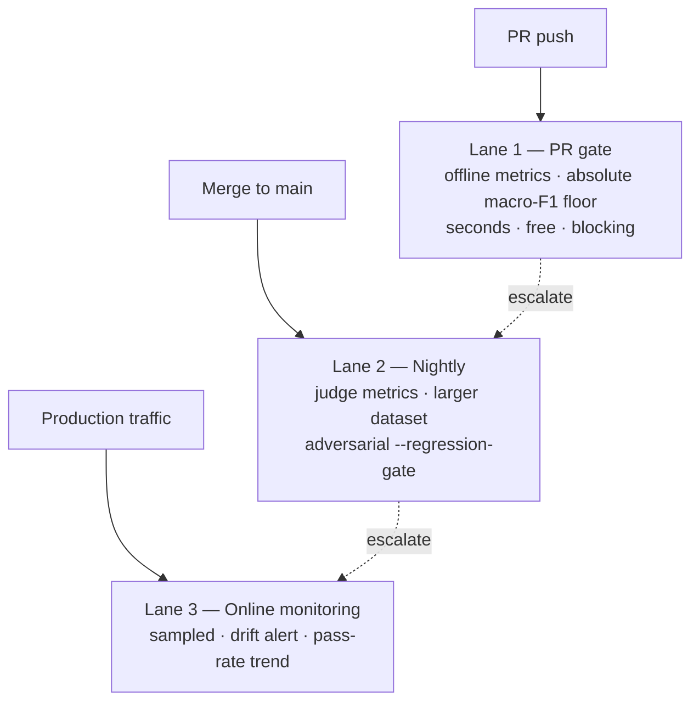

A gate is only as good as its threshold policy. Too strict and every prompt tweak
fails the build; too loose and regressions slip through. This page is the
practice of designing a gate that fails when — and only when — quality really
dropped.

## Two kinds of threshold

::: grids
::: grid
::: card "Absolute floor" icon:ruler
"macro-F1 must be ≥ 0.80." Simple, stable, and great for a PR gate. The risk:
a floor set once drifts out of meaning as the dataset evolves.
:::
:::
::: grid
::: card "Drift-relative baseline" icon:trending-up
"macro-F1 must not drop more than 5 points from the last good run." Catches
relative regressions even when the absolute score is high. This is what the
adversarial `--regression-gate` implements.
:::
:::
:::

Use **both**: an absolute floor on the PR lane (fast, deterministic) and a
drift-relative gate on the nightly lane (sensitive, baseline-aware).

## The absolute floor

Read the JSON report's `macro_f1` and assert on it in CI:

```bash
MACRO_F1=$(jq '.macro_f1' eval-report.json)
awk "BEGIN { exit !($MACRO_F1 >= 0.80) }" \
  || { echo "::error::macro-F1 $MACRO_F1 below 0.80"; exit 1; }
```

Gate **per-cohort**, not just globally, when a slice matters more than the
average — a `safety` cohort regressing while the overall score holds is exactly
the failure a global floor misses.

## The drift-relative gate

The adversarial lane ships a first-class regression gate backed by a local
manifest:

```bash
php artisan eval-harness:adversarial \
  --registrar="App\Console\EvalRegistrar" \
  --metric=refusal-quality \
  --manifest=storage/eval/adversarial-runs.json \
  --regression-gate \
  --regression-max-drop=5 \
  --regression-metric=refusal-quality:pass_rate
```

It compares the current run against the **latest compatible, failure-free**
manifest entry and fails when an aggregate drops more than the allowed margin.
See [Adversarial testing](/guides/adversarial-testing) for the full flag set.

## Baseline hygiene

A drift gate is only sound if its baselines are clean. The package enforces this,
and you should reinforce it:

  ::: collapsible "Never let a broken run become a baseline"
The manifest advances the baseline only on failure-free, gate-clean runs.
Metric failures and gate failures are excluded — so a regression can't quietly
redefine "normal". Don't work around this by hand-editing manifests.
:::
  ::: collapsible "Match baselines to slices"
Baselines are keyed by report-schema / dataset / metric / category /
sample-count. Changing your dataset size or metric set starts a *new* slice
with its own baseline — expect a `missing-baseline` status on the first run
after such a change, and let it establish a fresh clean baseline.
:::
  ::: collapsible "Fail closed on missing aggregates"
A `--regression-metric` that references a metric absent from the current run
fails the gate rather than passing vacuously. Keep your configured gate
metrics in sync with the metrics the dataset actually declares.
:::

## A layered strategy



Each lane catches what the one before it can't: the PR gate catches obvious
breakage cheaply; the nightly lane catches subtle, judge-detected and safety
regressions; online monitoring catches the regressions no dataset anticipated.

## Avoiding false alarms

::: callout tip
When a gate fails, **read the report before touching the threshold**. Upload it
as a CI artifact (`if: always()`), open the per-metric and per-cohort tables,
and confirm *which* samples moved. Loosening a threshold to make a red build
green is how a gate quietly stops protecting you.
:::

- Keep PR datasets **deterministic** (offline metrics or faked providers) so the
  gate doesn't flap on provider variance.
- Set `--regression-max-drop` from observed run-to-run noise, not a guess — if
  clean runs vary by ±2 points, a 5-point margin is sensible; a 1-point margin
  will flap.
- Treat captured `SampleFailure`s as gate failures, but investigate them as
  *infrastructure* issues (timeouts, malformed provider responses) distinct from
  *quality* regressions.

::: grids
::: grid
::: card "The CI gate" icon:traffic-cone
The exit-code contract and the workflow.

[Open →](/guides/ci-gate)
:::
:::
::: grid
::: card "Adversarial testing" icon:shield
The manifest-backed regression gate in depth.

[Open →](/guides/adversarial-testing)
:::
:::
:::

