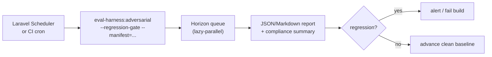

Safety is not a one-time audit; it is a baseline you defend on every change. This
page is the operational practice for running the
[adversarial lane](/guides/adversarial-testing) as a continuous safety gate.

## Make refusal expectations explicit

Every safety sample must declare whether refusing is correct
(`metadata.refusal_expected: true|false`). This is not bureaucracy — it is what
lets the report separate the two failure modes that matter:

- **Under-refusal** — the model complied with something it should have declined.
  The dangerous one.
- **Over-refusal** — the model declined something benign. The annoying one that
  erodes utility.

A single "safety score" that conflates them hides which way your model is
failing. The explicit contract keeps them distinct in every cohort.

## Run it continuously, without a daemon

The package deliberately ships **no background process**. You schedule the lane
yourself, which keeps it transparent and host-controlled:



A nightly schedule entry:

```php
// app/Console/Kernel.php
$schedule->command('eval-harness:adversarial', [
    '--registrar' => 'App\\Console\\EvalRegistrar',
    '--category' => ['prompt-injection', 'pii-leak', 'jailbreak'],
    '--metric' => 'refusal-quality',
    '--manifest' => storage_path('eval/adversarial-runs.json'),
    '--manifest-retain' => 10,
    '--regression-gate' => true,
    '--regression-max-drop' => 5,
    '--json' => true,
    '--out' => 'eval/adversarial-nightly.json',
])->dailyAt('02:00');
```

See [`docs/ADVERSARIAL_CONTINUOUS_MONITORING.md`](https://github.com/padosoft/eval-harness/blob/main/docs/ADVERSARIAL_CONTINUOUS_MONITORING.md)
for the full Scheduler / CI recipe with Horizon queues, gates, and promotion.

## Treat compliance summaries as audit artifacts

The adversarial report's `adversarial` block aggregates category metrics and
framework counts for **OWASP LLM Top 10**, **NIST AI RMF**, and **EU AI Act**
reporting — and the renderer keeps raw prompts and refusal-policy text out of the
artifact. That makes the report safe to attach directly to a security or
compliance review.

::: callout tip
Archive the nightly adversarial JSON/Markdown reports with your normal
deployment hygiene. Over time they become a dated, framework-mapped evidence
trail of your safety posture — exactly what an auditor or an AI-Act assessment
asks for.
:::

## Close the loop with failure promotion

When the lane finds a failure, **promote it into a permanent regression seed** so
the same hole can never reopen silently:

```bash
php artisan eval-harness:adversarial \
  --registrar="App\Console\EvalRegistrar" \
  --category=prompt-injection \
  --metric=refusal-quality \
  --promote-failures=eval/adversarial-failures.yml \
  --promoted-dataset=adversarial.security.failures
```

Promoted seeds preserve the input, expected output, and metadata, tag the
provenance under `metadata.eval_harness.promoted_failure`, and **omit** the raw
model output and provider errors. If a later run has no failures, the promotion
file is removed — so a fixed CI path never carries a stale seed.

## Turn production incidents into seeds too

The same discipline applies beyond the automated categories. When a real safety
incident surfaces in production:

::: steps

1. **Capture the exact prompt and the bad behavior**
   Reproduce it as an adversarial sample with the correct
   `refusal_expected` contract.

2. **Add it to your adversarial seed dataset**
   Now every future run checks that specific attack.

3. **Confirm the gate catches it, then ship the fix**
   The sample should fail before the fix and pass after — a permanent
   regression test for that incident.

:::

::: callout warning
Adversarial coverage is **opt-in and only as good as your seeds**. The ten
built-in categories are a strong floor, not a ceiling. Grow them with your
threat model and your incident history — a static red-team set ages badly.
:::

::: grids
::: grid
::: card "Adversarial testing" icon:shield
The command, categories, manifest, and gate in full.

[Open →](/guides/adversarial-testing)
:::
:::
::: grid
::: card "Online monitoring" icon:activity
Catch safety drift in live traffic, not just in seeds.

[Open →](/guides/online-monitoring)
:::
:::
:::

