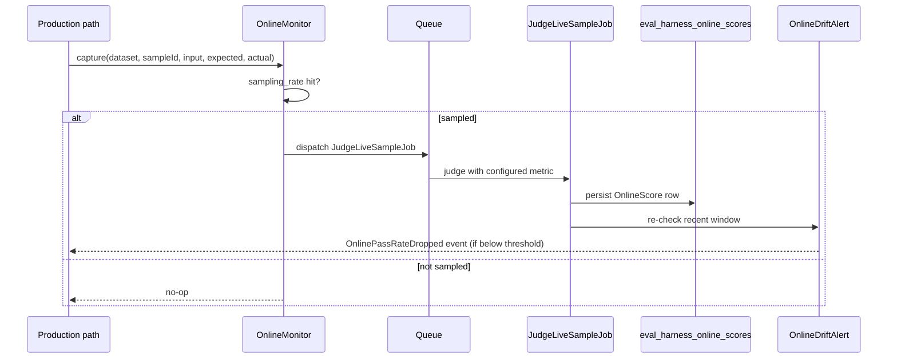

A golden dataset catches the regressions you anticipated. **Online monitoring**
catches the ones you didn't — by sampling real production traffic, judging it,
and alerting when live quality drifts down. It is **off by default**; you opt in
explicitly and call one method from your production path.

## How it works



## Enable it

Online monitoring is the one feature that persists rows. Publish and run its
migration, then enable it in config:

```bash
php artisan vendor:publish --tag=eval-harness-migrations
php artisan migrate
```

```php
// config/eval-harness.php
'online' => [
    'enabled'        => true,
    'sampling_rate'  => 0.05,            // judge 5% of captured traffic
    'metric'         => 'llm-as-judge',
    'pass_threshold' => 0.7,
    'queue'          => 'evals',
    'alert' => [
        'threshold'   => 0.8,            // alert if recent pass-rate < 0.8
        'window'      => 50,             // over the last 50 judged samples
        'min_samples' => 20,             // but only once 20+ exist
    ],
],
```

The migration creates `eval_harness_online_scores`, indexed for the
pass-rate-over-time query.

## Capture from your production path

After your pipeline generates an answer, hand it to the monitor. On a sampling
hit it dispatches the judge job; otherwise it is a cheap no-op:

```php
use Padosoft\EvalHarness\Online\OnlineMonitor;

app(OnlineMonitor::class)->capture(
    dataset: 'rag.faq',
    sampleId: (string) $request->id,
    input: ['question' => $question],
    expected: $goldenAnswerOrReference,
    actual: $modelAnswer,
);
```

::: callout info
`expected` is the reference the judge grades **against** — supply a real one (a
known-good FAQ answer, a retrieved canonical document, a human-curated
reference). The default `llm-as-judge` metric grades the actual answer against
`expected`, so it needs a meaningful reference; passing an empty or placeholder
string makes the score meaningless. If you genuinely have no reference at
capture time, configure a **custom `llm-as-judge` `prompt_template` that ignores
`{expected}`** and grades the answer on its own merits — that is the only
supported reference-less path.
:::

::: callout warning
Do **not** set `online.metric` to `refusal-quality` for online monitoring. The
sampled `JudgeLiveSampleJob` builds its `DatasetSample` from `id` / `input` /
`expected` only — with **no metadata** — but `refusal-quality` requires
`metadata.refusal_expected`, so every sampled judgement would fail and no
`OnlineScore` rows (or drift alerts) would be produced. Drive refusal scoring
through the [adversarial lane](/guides/adversarial-testing) instead, where the
seed samples carry that metadata.
:::

## Drift alerts

After each judged sample, `OnlineDriftAlert` re-checks the recent window. When
the pass-rate over the last `window` samples drops below `alert.threshold` (and
at least `min_samples` exist), it fires `OnlinePassRateDropped`. Register a
listener to route it anywhere:

```php
use Illuminate\Support\Facades\Event;
use Padosoft\EvalHarness\Online\Events\OnlinePassRateDropped;

Event::listen(function (OnlinePassRateDropped $e): void {
    // $e->dataset, $e->passRate, $e->threshold
    // notify your on-call channel: Slack, PagerDuty, etc.
});
```

The `min_samples` floor prevents a noisy alert storm before enough data exists to
mean anything.

## The trend endpoint

With the [report API](/reference/report-api) enabled, a read-only endpoint feeds
the pass-rate chart in the companion admin panel:

```
GET /{prefix}/online/{dataset}/trend?limit=N
```

It returns chronological pass-rate points plus the configured alert `threshold`
(which drives the dashboard's alert band), aggregated by calendar date.

## Cost control

Two knobs keep monitoring affordable:

- **`sampling_rate`** — judge a fraction of traffic, not all of it. 1–5% is
  usually enough to spot drift on a busy endpoint.
- **`queue` / `connection`** — judging happens on a queue (Horizon-ready), so it
  never blocks the user request and can be rate-shaped independently.

::: callout warning
Online monitoring judges live traffic with a provider, so it incurs ongoing
cost proportional to `sampling_rate × volume`. Start at a low sampling rate and
raise it only if drift detection needs more signal.
:::

::: grids
::: grid
::: card "Judge calibration" icon:ruler
Calibrate the metric before you alert on it.

[Open →](/guides/judge-calibration)
:::
:::
::: grid
::: card "Horizon & queues" icon:server
Run the judge jobs on production workers.

[Open →](/operations/horizon-and-queues)
:::
:::
:::

