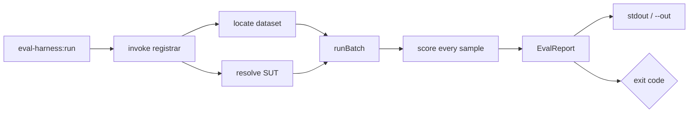

A run has three moving parts: a **registrar** that declares datasets and metrics,
a **system under test (SUT)** that produces outputs, and the **`eval-harness:run`**
command that ties them together and emits a report.

## The registrar pattern

A registrar is an invokable class that receives the `EvalEngine`, registers one
or more datasets with their metrics, and binds the SUT into the container:

```php
<?php

namespace App\Console;

use Illuminate\Contracts\Container\Container;
use Padosoft\EvalHarness\EvalEngine;

class EvalRegistrar
{
    public function __construct(private readonly Container $container) {}

    public function __invoke(EvalEngine $engine): void
    {
        $engine->dataset('rag.factuality.fy2026')
            ->loadFromYaml(base_path('eval/golden/factuality.yml'))
            ->withMetrics(['exact-match', 'cosine-embedding'])
            ->register();

        $this->container->bind('eval-harness.sut', fn () =>
            fn (array $input): string => app(\App\Rag\KnowledgeAgent::class)
                ->answer($input['question']),
        );
    }
}
```

Keeping registration in code (not config) means your datasets, metrics, and SUT
wiring are versioned, testable, and resolved through the same container your app
uses in production.

## Binding the SUT

The SUT is the thing under evaluation. It takes a sample's `input` and returns
the actual output. Two binding styles:

::: tabs

== tab "Callable (serial only)"
The simplest form — a closure bound to `eval-harness.sut`. Works with the
default serial batch.

```php
$this->container->bind('eval-harness.sut', fn () =>
    fn (array $input): string => app(KnowledgeAgent::class)->answer($input['question']),
);
```

== tab "SampleRunner (queue-ready)"
A container-resolvable concrete class implementing the runner contract.
**Required** for `--batch=lazy-parallel`, because queued jobs carry only the
runner class name.

```php
$this->app->bind('eval-harness.sut', \App\Eval\MyRagRunner::class);
```

:::

::: callout info
Closures and arbitrary callables are **serial-only**. For queue-backed
execution the SUT must be a concrete `SampleRunner` class the worker container
can re-resolve. See [Batch execution](/operations/batch-execution) for the
full serializability rules.
:::

## The command

```bash
php artisan eval-harness:run rag.factuality.fy2026 \
  --registrar="App\Console\EvalRegistrar" \
  --json --out=factuality.json
```

Common flags:

| flag | purpose |
| --- | --- |
| `--registrar=` | The registrar class to invoke before running. |
| `--json` | Render JSON instead of Markdown. |
| `--out=` | Write the report to a path on the reports disk (or literal with `--raw-path`). |
| `--raw-path` | Treat `--out` as a literal filesystem path (parent must exist). |
| `--outputs=` | Score precomputed outputs instead of invoking the SUT (see [Scoring saved outputs](/guides/scoring-saved-outputs)). |
| `--batch=serial\|lazy-parallel` | Execution mode (default `serial`). |
| `--batch-profile=ci\|smoke\|nightly` | Apply a named preset of batch defaults. |

Run `php artisan eval-harness:run --help` for the authoritative, version-current
option list. Batch and backpressure flags are documented in
[Batch execution](/operations/batch-execution).

## Reading the result

By default the command renders a Markdown report to stdout and sets the
**exit code** from the report: `0` when every metric scored cleanly, non-zero on
any captured failure. With `--json --out=` it writes the stable, versioned JSON
payload to disk for a dashboard or the report API to consume.



## Eval sets and resumable manifests

When one CI or release gate must run **several** datasets in order, group them
into an **eval set**. The returned manifest is stable JSON; store it between
attempts and pass it back so completed datasets are skipped on a retry:

```php
use Padosoft\EvalHarness\Batches\BatchOptions;
use Padosoft\EvalHarness\EvalSets\EvalSetManifest;
use Padosoft\EvalHarness\Facades\EvalFacade;

$evalSet = EvalFacade::evalSet('release.rag', [
    'rag.factuality.fy2026',
    'rag.refusals.fy2026',
]);

$result = EvalFacade::runEvalSet(
    $evalSet,
    app(\App\Eval\MyRagRunner::class),
    BatchOptions::serial(),
    $previousManifest ?? null,   // EvalSetManifest::fromJson(...) if a prior run exists
);

file_put_contents($manifestPath, json_encode($result->manifest->toJson(), JSON_PRETTY_PRINT));
```

This makes a long multi-dataset release gate **resumable** — an interrupted run
picks up where it left off instead of repeating completed datasets.

::: grids
::: grid
::: card "The CI gate" icon:traffic-cone
Wire the exit code into GitHub Actions.

[Open →](/guides/ci-gate)
:::
:::
::: grid
::: card "Batch execution" icon:layers
Serial, lazy-parallel, profiles, and backpressure.

[Open →](/operations/batch-execution)
:::
:::
:::

