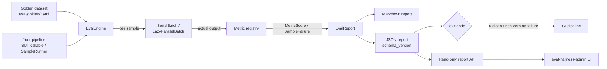

## What eval-harness is

**`padosoft/eval-harness` is a Laravel-native evaluation framework for RAG and
LLM applications.** It gives the non-deterministic part of your stack — the
retriever, the prompt, the model, the chunker — the same regression protection
your business logic has had for fifteen years: a curated golden dataset, a set
of declared metrics, and a CI gate that fails the build when a **macro-F1
threshold you set** is breached (or a metric errors). The raw command exit code
is an execution-health signal; you turn it into a quality gate by asserting on
the report's `macro_f1` — see [the CI gate](/guides/ci-gate).

It runs **inside your application container**, resolving your real Laravel
services directly. Datasets are **YAML** (reviewable in pull requests), reports
are **JSON + Markdown** (diffable artifacts), and every external call goes
through Laravel's `Http::` facade so the entire offline path is deterministic
and free.

::: callout info
Your PHPUnit suite green-lights a deploy because it does not know what a
*correct answer* looks like. Bump an embedding model, swap `gpt-4o` for
`gpt-4o-mini`, tweak a prompt template, or change the chunker, and every one
of those is a silent quality-regression risk with **no programmatic signal**.
eval-harness closes that loop: a golden dataset plus a macro-F1 gate turns
"we have AI in prod" into "we have a regression test for our AI in prod".
:::

## How it fits together

## The differentiators

These are the things no other public evaluation tool ships in a single
Laravel-native package. Each links to the page that explains the theory, the
design, and the rationale in depth.

::: grids
::: grid
::: card "Fifteen metrics out of the box" icon:square-function
Lexical, structural, semantic, LLM-as-judge, ordinal, citation-groundedness,
and the full retrieval-ranking family (hit@k / recall@k / MRR / nDCG@k /
containment) behind a clean `Metric` interface.

[Open →](/metrics/overview)
:::
:::
::: grid
::: card "Trustworthy LLM judges" icon:scale
Calibrate the judge against human labels before you gate on it: verdict
agreement rate, a confusion matrix, a length-bias signal, and a
self-preference guard that fails when the judge equals the model under test.

[Open →](/guides/judge-calibration)
:::
:::
::: grid
::: card "Production online monitoring" icon:activity
Sample live AI traffic, judge it on a queue, chart pass-rate drift, and fire
an `OnlinePassRateDropped` event when recent quality dips below
threshold. Off by default; Horizon-ready.

[Open →](/guides/online-monitoring)
:::
:::
::: grid
::: card "Adversarial red-team lane" icon:shield
Opt-in safety regression seeds across 10 categories, OWASP LLM /
NIST AI RMF / EU AI Act compliance summaries, a manifest
regression gate, and failure-promotion back to reusable datasets.

[Open →](/guides/adversarial-testing)
:::
:::
::: grid
::: card "Queue / Horizon batch execution" icon:layers
Deterministic `SerialBatch` by default, or queue-backed
`LazyParallelBatch` with operational profiles, producer-side
backpressure, and progress checkpoints.

[Open →](/operations/batch-execution)
:::
:::
::: grid
::: card "Local-first, no lock-in" icon:lock-open
YAML datasets, JSON/Markdown reports, a single optional migration, any
OpenAI-compatible provider via `Http::`. Apache-2.0, headless,
provider-agnostic.

[Open →](/installation)
:::
:::
:::

## Who it is for

- **Laravel engineering teams** with a RAG or LLM feature in production and no
  programmatic quality signal on model / prompt / retriever changes.
- **Platform & MLOps owners** who want a CI gate, nightly safety baselines, and
  a pass-rate-over-time dashboard without adopting a hosted Python platform.
- **Regulated-industry operators** who need refusal-quality scoring, adversarial
  coverage, and compliance-framework summaries (OWASP / NIST / EU AI Act).
- **Anyone allergic to vendor lock-in** who wants offline-deterministic,
  diffable evaluation artifacts they own.

## Where to go next

::: grids
::: grid
::: card "Quickstart" icon:zap
Curate a dataset, wire a registrar, and gate your first run in five minutes.

[Open →](/quickstart)
:::
:::
::: grid
::: card "Core concepts" icon:workflow
Datasets, samples, metrics, the SUT, reports, macro-F1, cohorts, and gates.

[Open →](/core-concepts)
:::
:::
::: grid
::: card "Architecture" icon:network
The engine, the batch layer, the metric registry, and the report contract.

[Open →](/architecture/overview)
:::
:::
:::

