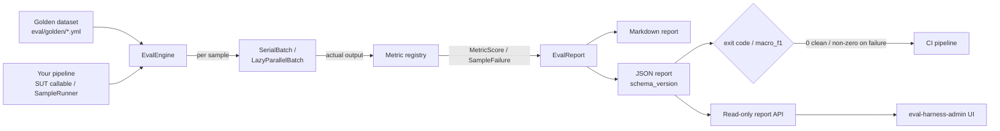

# eval-harness


> **eval-harness gives the non-deterministic part of your stack — the retriever, the prompt, the model, the chunker — the same regression protection your business logic has had for fifteen years.**
> A curated golden dataset, a set of declared metrics, and an Artisan CI gate that fails the build when quality drops — all running **inside your Laravel app**, on YAML datasets you review in pull requests.

::: callout info "New here? Read this page top to bottom" icon:compass
In five minutes you'll know exactly what this package is, the problem it solves, why it beats every
"just spot-check the output" alternative, and where to click next. Every other page goes deeper — this
one gives you the whole picture.
:::

---

## What it is — in one minute

If you ship a RAG or LLM feature on Laravel, your quality is **invisible until a user complains**. Your
PHPUnit suite green-lights a deploy because it has no idea what a *correct answer* looks like. Bump an
embedding model, swap `gpt-4o` for `gpt-4o-mini` to save cost, tweak a prompt template, or change the
chunker from a sliding window to semantic — every one of those is a silent quality-regression risk with
**no programmatic signal** that it shipped intact.

`padosoft/eval-harness` closes that loop with three moving parts:

- **Curate a golden dataset** — a YAML file of 30–200 `(question, expected answer)` pairs that represent
  the queries you actually care about, reviewable and diffable right in the pull request.
- **Declare metrics** — exact-match for deterministic outputs, cosine-embedding for paraphrase tolerance,
  LLM-as-judge for subjective grading, retrieval-ranking for how well your retriever ranks — fifteen
  built in, behind a clean `Metric` interface for your own.
- **Gate CI on quality** — `php artisan eval-harness:run` produces JSON + Markdown reports and a
  non-zero exit on failure; assert on the report's `macro_f1` and you have a regression gate in the same
  workflow that runs your unit tests.

> **In one line:** *the shortest path from "we have AI in prod" to "we have a regression test for our
> AI in prod" — Laravel-native, local-first, provider-agnostic.*

---

## The problem it solves

Every team shipping AI hits the same wall: quality is unmeasured, unattributed and silently drifting.
Here is the gap this package closes.

| Without eval-harness | With eval-harness |
|---|---|
| PHPUnit green-lights a deploy — it has no idea what a *correct answer* looks like. | A golden dataset + a macro-F1 gate fail the build the moment quality regresses. |
| You bump an embedding model or swap a chat model for cost, and pray nothing broke. | Every model / prompt / retriever / chunker change is scored against the same dataset before merge. |
| "Quality" is a spot-check someone does by hand, once, then forgets. | A repeatable run with `mean`, `p50`, `p95`, pass-rate and macro-F1 — diffable across releases. |
| Your eval lives in a Python notebook nobody runs, far from your Laravel code. | It runs **inside your app container**, resolving your real services through `Http::` — `Http::fake()` makes the offline path deterministic and free. |
| You trust an LLM judge that quietly rubber-stamps regressions. | Calibrate the judge against human labels — agreement rate, confusion matrix, length-bias and self-preference guards gate CI on judge trustworthiness, not vibes. |
| Safety only gets tested after an incident makes the news. | An opt-in adversarial red-team lane with OWASP / NIST / EU AI Act summaries and a regression gate. |
| Live quality silently degrades and nobody notices until churn. | Production online monitoring samples live traffic, charts pass-rate drift, and fires an event when it dips. |

---

## Who it's for

::: grids
  ::: grid
    ::: card "RAG builders" icon:search
    Shipping a retrieval-augmented feature and want hit@k / recall@k / MRR / nDCG@k plus
    citation-groundedness on a dataset you own — without porting your pipeline to Python.
    :::
  :::
  ::: grid
    ::: card "LLM app teams" icon:bot
    A prompt, a model and a chain in production with no quality signal on changes. Curate a dataset,
    declare metrics, and gate every PR on macro-F1.
    :::
  :::
  ::: grid
    ::: card "QA & MLOps" icon:gauge
    Want a CI gate, nightly safety baselines, and a pass-rate-over-time dashboard without adopting a
    hosted Python platform or a SaaS workspace.
    :::
  :::
  ::: grid
    ::: card "Regulated-industry operators" icon:scale
    Need refusal-quality scoring, adversarial coverage, and compliance-framework summaries
    (OWASP LLM / NIST AI RMF / EU AI Act) as diffable, auditable artifacts.
    :::
  :::
:::

---

## Why it's different — the moats

Most eval tooling is Python, hosted, or both. This package is the one that lives where your RAG pipeline
already lives, and goes further than "run the prompt and eyeball it".

::: grids
  ::: grid
    ::: card "Laravel-native, runs in your app" icon:server
    It resolves your real Laravel services directly and routes every external call through the `Http::`
    facade. `Http::fake()` and fake LLM/embedding clients make the whole offline path deterministic — no
    SDK lock-in, no separate runtime.
    :::
  :::
  ::: grid
    ::: card "Fifteen metrics out of the box" icon:square-function
    `exact-match`, `contains`, `regex`, `rouge-l`, `citation-groundedness`, `cosine-embedding`,
    `bertscore-like`, `llm-as-judge`, `refusal-quality`, `ordinal-distance`, and the full
    retrieval-ranking family — behind a clean `Metric` interface for your own.
    :::
  :::
  ::: grid
    ::: card "Retrieval-ranking, done right" icon:list-ordered
    hit@k, recall@k, MRR, nDCG@k (binary or graded gains) and top-k answer containment over the ranked
    list your retriever emits. One tested source of truth for the easy-to-get-wrong RAG ranking math.
    :::
  :::
  ::: grid
    ::: card "Trustworthy LLM judges" icon:scale
    Calibrate the judge against human labels before you gate on it: verdict agreement rate, confusion
    matrix, a length-bias signal, and a self-preference guard that fails when the judge equals the model
    under test.
    :::
  :::
  ::: grid
    ::: card "Deterministic by design" icon:lock
    LLM-as-judge runs at temperature 0, seed 42, `response_format=json_object`, with a strict-JSON
    parser that rejects malformed responses instead of silently scoring 0. Failures are captured per
    `(sample, metric)`, not masked.
    :::
  :::
  ::: grid
    ::: card "CI gate that exits non-zero" icon:circle-check
    `php artisan eval-harness:run` produces a stable, versioned JSON + Markdown report and fails on any
    captured failure. Wire it into the same workflow your PHPUnit suite runs in.
    :::
  :::
  ::: grid
    ::: card "YAML datasets you own" icon:file-text
    Datasets live in `eval/golden/*.yml` next to your code — reviewable in PRs, diffable across
    releases, surviving database wipes. No DB migrations required for the core path.
    :::
  :::
  ::: grid
    ::: card "Adversarial red-team lane" icon:shield
    Opt-in safety regression seeds across 10 categories, OWASP LLM / NIST AI RMF / EU AI Act compliance
    summaries, a manifest regression gate, and failure-promotion back to reusable datasets.
    :::
  :::
  ::: grid
    ::: card "Production online monitoring" icon:activity
    Sample live AI traffic, judge it on a queue, chart pass-rate drift, and fire an
    `OnlinePassRateDropped` event when recent quality dips. Off by default; Horizon-ready.
    :::
  :::
:::

---

## See it: the companion admin panel

This package stays **headless** — but a polished companion web admin panel ships separately as
[`padosoft/eval-harness-admin`](https://github.com/padosoft/eval-harness-admin). It consumes this
package's read-only report API directly — no mocks — to browse stored reports, compare regressions,
inspect adversarial manifests, follow live batch progress, and watch production pass-rate trends.


---

## eval-harness vs. the alternatives

| Capability | **eval-harness** | Python eval libs (Ragas / DeepEval) | Manual spot-checks | No eval at all |
|---|:---:|:---:|:---:|:---:|
| Laravel-native, runs in your app container | ✅ | ❌ | ➖ | ❌ |
| YAML datasets, diffable in a PR | ✅ | ✅ | ❌ | ❌ |
| Retrieval-ranking metric family (hit@k / nDCG@k…) | ✅ | ✅ | ❌ | ❌ |
| Judge calibration against human labels | ✅ | ➖ | ❌ | ❌ |
| Artisan CI gate (non-zero exit on regression) | ✅ | ➖ | ❌ | ❌ |
| Deterministic offline path (`Http::fake`) | ✅ | ➖ | ➖ | ❌ |
| Adversarial / compliance summaries (OWASP / NIST / EU AI Act) | ✅ | ➖ | ❌ | ❌ |
| Production online pass-rate monitoring | ✅ | ➖ | ❌ | ❌ |
| Repeatable, free for offline metrics | ✅ | ➖ | ❌ | ✅ |

> Legend: ✅ built-in · ➖ partial / outside the Laravel-native path / extra cost · ❌ not available.

The Python-stack tools are excellent **if your stack is Python**. If your RAG pipeline lives in a
Laravel monolith, eval-harness is the shortest path from "we have AI in prod" to "we have a regression
test for our AI in prod".

---

## How it fits together

A golden dataset and your pipeline flow through the engine; each sample is scored by the metric registry
into a versioned report that drives the CI gate and the read-only API.



---

## Start in 30 seconds

::: steps
1. **Install the package**
   ```bash
   composer require padosoft/eval-harness
   php artisan vendor:publish --tag=eval-harness-config
   ```
   It's auto-discovered — no `config/app.php` edits. The config file lets you override the embeddings +
   judge endpoints, models and API keys.

2. **Curate a golden dataset** in `eval/golden/factuality.yml`
   ```yaml
   schema_version: eval-harness.dataset.v1
   name: rag.factuality.fy2026
   samples:
     - id: capital-france
       input: { question: "What is the capital of France?" }
       expected_output: "Paris"
       metadata: { tags: [geography, easy] }
   ```

3. **Run the eval and gate CI**
   ```bash
   php artisan eval-harness:run rag.factuality.fy2026 \
     --registrar="App\Console\EvalRegistrar" \
     --json --out=factuality.json
   ```
   Exit code is `0` if every metric scored cleanly, non-zero otherwise. Assert on the report's
   `macro_f1` and wire it into the same workflow that runs your PHPUnit suite.
:::

**[→ Quickstart](/quickstart)** · **[→ Installation](/installation)** · **[→ The CI gate](/guides/ci-gate)**

---

## Batteries included for AI-assisted development

This repo ships an **AI vibe-coding pack** — a `CLAUDE.md` working guide, an `AGENTS.md` workflow
contract, and invocable `.claude/skills/` encoding the TDD loop, the metric/report contract rules, the
docs-sync discipline, and the PR/Copilot review loop. Open the package in Claude Code, Cursor, Copilot
or Codex and your agent already knows the house rules.

---

## Where to go next

::: grids
  ::: grid
    ::: card "Quickstart" icon:zap
    Curate a dataset, wire a registrar, and gate your first run in five minutes. **[Open →](/quickstart)**
    :::
  :::
  ::: grid
    ::: card "Core concepts" icon:workflow
    Datasets, samples, metrics, the SUT, reports, macro-F1, cohorts and gates. **[Read →](/core-concepts)**
    :::
  :::
  ::: grid
    ::: card "Metrics overview" icon:square-function
    All fifteen metrics — lexical, semantic, judge, ordinal, citation and retrieval-ranking. **[Explore →](/metrics/overview)**
    :::
  :::
:::

::: callout tip "Package facts" icon:info
Composer `padosoft/eval-harness` · PHP `^8.3` (8.4 / 8.5) · Laravel `^12 || ^13` ·
`laravel/ai` `^0.6` · Apache-2.0 ·
[GitHub](https://github.com/padosoft/eval-harness) · [Packagist](https://packagist.org/packages/padosoft/eval-harness)
:::
