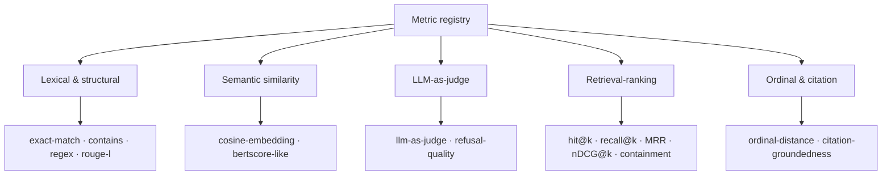

## The contract

Every metric implements a small two-method interface: `name()` returns the
metric's alias, and `score()` receives a sample and the SUT's actual output and
returns a `MetricScore` — a real number in $[0, 1]$ plus optional structured
details:

```php
interface Metric
{
    public function name(): string;

    public function score(DatasetSample $sample, string $actualOutput): MetricScore;
}
```

A score of $1.0$ is a perfect match for that metric's notion of correctness;
$0.0$ is a complete miss. The **pass-rate** aggregate counts a sample as passing
when its score is $\ge 0.5$. Because every metric shares the $[0, 1]$ codomain,
heterogeneous metrics aggregate cleanly into one **macro-F1** number — see
[Ordinal & aggregation](/metrics/ordinal-and-aggregation).

## The five families



| Family | Metrics | Network? | Determinism |
| --- | --- | --- | --- |
| [Lexical & structural](/metrics/lexical-and-structural) | `exact-match`, `contains`, `regex`, `rouge-l` | none | exact |
| [Semantic similarity](/metrics/semantic-similarity) | `cosine-embedding`, `bertscore-like` | embeddings | fakeable |
| [LLM-as-judge](/metrics/llm-as-judge) | `llm-as-judge`, `refusal-quality` | chat completions | seed 42, temp 0 |
| [Retrieval-ranking](/metrics/retrieval-ranking) | `retrieval-hit-at-k`, `retrieval-recall-at-k`, `retrieval-mrr`, `retrieval-ndcg-at-k`, `answer-containment-at-k` | none | exact |
| [Ordinal & citation](/metrics/ordinal-and-aggregation) | `ordinal-distance`, `citation-groundedness` | none | exact |

That is **fifteen metrics**: four lexical/structural, two semantic, two judge,
five retrieval-ranking, and two ordinal/citation.

## Resolving metrics

`withMetrics([...])` accepts any mix of the three resolver forms. Built-in
aliases resolve through the container with zero extra binding:

```php
$engine->dataset('rag.factuality')
    ->loadFromYaml(base_path('eval/golden/factuality.yml'))
    ->withMetrics([
        'exact-match',                       // alias
        'cosine-embedding',                  // alias (needs embeddings provider)
        new JaccardWordOverlapMetric(),      // your own instance
        \App\Eval\DomainSpecificMetric::class // FQCN, resolved by container
    ])
    ->register();
```

The retrieval aliases and `answer-containment-at-k` auto-wire. `ordinal-distance`
needs an ordered scale, so pass an instance
(`new OrdinalDistanceMetric([...])`) or bind one under the alias.

## Choosing a metric

  ::: collapsible "The output is a single deterministic fact (an id, a date, a yes/no)"
Use `exact-match`. Add `contains` or `regex` if the answer is embedded in a
longer sentence and only a substring/pattern must be present.
:::
  ::: collapsible "The output is free-form prose that can be paraphrased many ways"
Use `cosine-embedding` (paraphrase-tolerant semantic overlap) and/or
`rouge-l` (token-sequence overlap). For a token-level precision/recall view
of semantic overlap, add `bertscore-like`.
:::
  ::: collapsible "Correctness is subjective and needs a rubric"
Use `llm-as-judge` — a deterministic, schema-checked judge. Calibrate it
against human labels before you gate on it (see
[Judge calibration](/guides/judge-calibration)).
:::
  ::: collapsible "You are measuring the retriever, not the generator"
Use the retrieval-ranking family. `recall@k` and `nDCG@k` for ranking
quality, `MRR` for first-hit position, `answer-containment-at-k` for
end-to-end "is the answer reachable in the top-k".
:::
  ::: collapsible "Safety / refusal behavior matters"
Use `refusal-quality` with `metadata.refusal_expected`, and drive the
adversarial lane (see [Adversarial testing](/guides/adversarial-testing)).
:::
  ::: collapsible "Labels are ordered (low < medium < high < urgent)"
Use `ordinal-distance` for graded partial credit instead of all-or-nothing
exact match.
:::
  ::: collapsible "Answers must cite their evidence"
Use `citation-groundedness`, optionally with `metadata.citation_evidence`
spans that require both a citation marker and the quoted text.
:::

::: callout tip
Most production datasets declare **two or three** metrics — one strict
(`exact-match`), one tolerant (`cosine-embedding` or `rouge-l`), and one
judge-based when correctness is subjective. The report shows each metric
independently, so you see *where* a regression bit, not just *that* it did.
:::

## Custom metrics

Implementing `Metric` is the extension point. A worked example:

```php
use Padosoft\EvalHarness\Datasets\DatasetSample;
use Padosoft\EvalHarness\Metrics\Metric;
use Padosoft\EvalHarness\Metrics\MetricScore;

class JaccardWordOverlapMetric implements Metric
{
    public function name(): string
    {
        return 'jaccard-words';
    }

    public function score(DatasetSample $sample, string $actualOutput): MetricScore
    {
        $expected = array_unique(preg_split('/\s+/', strtolower((string) $sample->expectedOutput)));
        $actual   = array_unique(preg_split('/\s+/', strtolower($actualOutput)));
        $union = array_unique(array_merge($expected, $actual));
        if ($union === []) {
            return new MetricScore(0.0);
        }

        return new MetricScore(count(array_intersect($expected, $actual)) / count($union));
    }
}
```

This is the Jaccard index $J(E, A) = \frac{|E \cap A|}{|E \cup A|}$ over word
sets — a complete, registry-ready metric in a dozen lines.

::: grids
::: grid
::: card "Retrieval-ranking math" icon:trophy
hit@k, recall@k, MRR, and nDCG@k derived from first principles.

[Open →](/metrics/retrieval-ranking)
:::
:::
::: grid
::: card "Metrics catalog" icon:table
Every alias, its inputs, codomain, and configuration knobs in one table.

[Open →](/reference/metrics-catalog)
:::
:::
:::

