Lexical metrics break the moment a correct answer is phrased differently from the
reference. Semantic metrics fix that by scoring in **embedding space**, where
"You may return within a month" and "Returns are accepted up to 30 days" sit
close together even though they share few tokens.

Both metrics call an OpenAI-compatible embeddings endpoint through the
`EmbeddingClient` contract — which you can fake (`Http::fake()` or a bound
deterministic client) so the offline test suite never touches the network.

## cosine-embedding

Embed the expected output and the actual output into vectors $\mathbf{e}$ and
$\mathbf{a}$, then score their **cosine similarity**:

$$
\cos(\mathbf{e}, \mathbf{a}) = \frac{\mathbf{e} \cdot \mathbf{a}}{\lVert \mathbf{e} \rVert \, \lVert \mathbf{a} \rVert}
= \frac{\sum_{i} e_i a_i}{\sqrt{\sum_i e_i^2}\,\sqrt{\sum_i a_i^2}}
$$

The result is mapped into $[0, 1]$ and returned as the score. Cosine similarity
measures the **angle** between the two vectors, not their magnitude — so it
captures topical/semantic alignment independent of length. This is the
workhorse metric for free-form answers that can be correct in many surface
forms.

```mermaid
flowchart LR
    E["expected_output"] --> EE[EmbeddingClient]
    A["actual_output"] --> AE[EmbeddingClient]
    EE --> V1["e&#8407;"]
    AE --> V2["a&#8407;"]
    V1 --> COS["cos(e&#8407;, a&#8407;)"]
    V2 --> COS
    COS --> S["score &#8712; [0,1]"]
```



::: callout info
Cosine-embedding scores the *whole answer* as one vector. It rewards topical
closeness but cannot tell you *which span* is wrong. When you need token-level
attribution, use `bertscore-like`.
:::

## bertscore-like

A token-level similarity in the spirit of **BERTScore** (Zhang et al., 2020).
Instead of one vector per answer, it embeds the unique tokens of each side and
greedily matches each token to its most similar counterpart, then computes
precision, recall, and F1 over those best matches.

Let $E = \{e_1, \dots, e_m\}$ be the reference token embeddings and
$A = \{a_1, \dots, a_n\}$ the candidate token embeddings. Greedy-match recall and
precision are:

$$
R_{\text{BERT}} = \frac{1}{m} \sum_{e_i \in E} \max_{a_j \in A} \cos(e_i, a_j),
\qquad
P_{\text{BERT}} = \frac{1}{n} \sum_{a_j \in A} \max_{e_i \in E} \cos(a_j, e_i)
$$

$$
F_{\text{BERT}} = \frac{2\, P_{\text{BERT}}\, R_{\text{BERT}}}{P_{\text{BERT}} + R_{\text{BERT}}}
$$

The metric returns $F_{\text{BERT}} \in [0, 1]$. Recall asks *"is every part of
the reference covered somewhere in the candidate?"*; precision asks *"is every
part of the candidate justified by the reference?"*; F1 balances the two.

::: callout tip
The implementation **deduplicates** token-embedding calls per sample, so
repeated tokens are embedded once. This keeps the provider cost bounded even
on long answers.
:::

## Determinism and faking

Both metrics depend only on the embedding vectors, so binding a deterministic
`EmbeddingClient` makes them fully reproducible offline:

```php
use Padosoft\EvalHarness\Contracts\EmbeddingClient;

$this->app->bind(EmbeddingClient::class, fn () => new class implements EmbeddingClient {
    /**
     * @param  list<string>  $texts
     * @return list<list<float>>  one vector per input, in the same order
     */
    public function embedMany(array $texts): array
    {
        // deterministic stub: hash-seeded pseudo-vectors, or fixture lookups
        return array_map(
            static fn (string $text): array => MyFixtures::vectorFor($text),
            $texts,
        );
    }
});
```

In CI you can either fake the client (free, deterministic) or point it at a real
embeddings endpoint (a true semantic signal at the cost of API calls). The
provider's `usage` (tokens, cost, latency) is attached to the `MetricScore`
details and rolls up into the report's usage summary.

## Choosing between them

| Question | Metric |
| --- | --- |
| Is the answer *topically* correct, any phrasing? | `cosine-embedding` |
| Which *parts* of the answer align with the reference? | `bertscore-like` |
| Cheapest semantic signal? | `cosine-embedding` (one embed per side) |
| Most discriminating on partially-correct prose? | `bertscore-like` |

::: callout warning
Embedding similarity is **not** faithfulness. A fluent, well-embedded answer
can still be factually wrong or ungrounded. Pair semantic metrics with
`citation-groundedness` or `llm-as-judge` when correctness — not just
topicality — is the gate.
:::

::: grids
::: grid
::: card "LLM-as-judge" icon:scale
When correctness needs a rubric, not a similarity score.

[Open →](/metrics/llm-as-judge)
:::
:::
::: grid
::: card "Lexical & structural" icon:spell-check
The deterministic, network-free surface metrics.

[Open →](/metrics/lexical-and-structural)
:::
:::
:::

