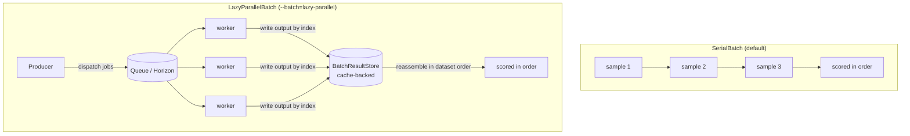
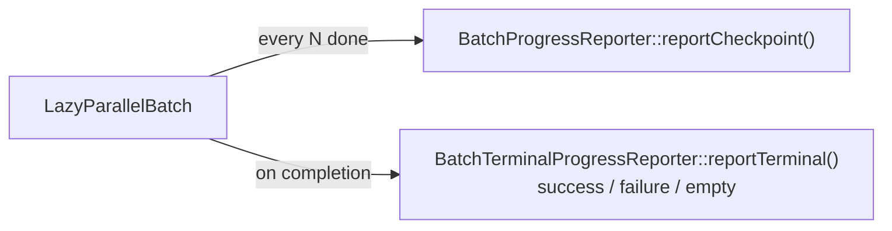

A run dispatches samples through a **batch**. The default is deterministic and
in-process; the alternative fans samples out across Laravel queue workers. This
page covers both and the knobs that shape throughput.

## Serial vs lazy-parallel



| | SerialBatch | LazyParallelBatch |
| --- | --- | --- |
| flag | default | `--batch=lazy-parallel` |
| execution | in-process, one at a time | queue jobs across workers |
| determinism | fully deterministic | order-preserving via indexed result store |
| SUT requirement | any callable | container-resolvable `SampleRunner` |
| best for | small datasets, tests, the PR gate | large datasets, judge-heavy runs, nightly |

Both produce an **identical report** — lazy-parallel reassembles outputs in
dataset order from the result store even though jobs finish out of order.

## SUT serializability

Queued jobs carry only the **runner class name**, so the worker re-resolves a
fresh runner from its container. That constrains what can run in parallel:

  ::: collapsible "Works in lazy-parallel"
A concrete `SampleRunner` class bound into the container, including one with
constructor-injected object dependencies the worker container can resolve to
an equivalent fresh instance.
:::
  ::: collapsible "Serial-only"
Arbitrary callables, closures, anonymous runners, runners with
optional/defaulted constructor state, scalar/array/null runner properties, and
any caller-specific object configuration — because none of it survives being
reduced to a class name.
:::

```php
// queue-ready
$this->app->bind('eval-harness.sut', \App\Eval\MyRagRunner::class);
```

## Operational profiles

`--batch-profile=ci|smoke|nightly` applies a named preset of batch defaults.
**Explicit CLI flags always win**, so profiles never lock you in.

| profile | shape |
| --- | --- |
| `ci` | lazy-parallel with sane CI defaults (modest concurrency, job timeout, periodic checkpoints) |
| `smoke` | serial, fast — a quick pre-merge sanity check |
| `nightly` | higher concurrency with throttled dispatch and checkpoints for long runs |

```bash
php artisan eval-harness:run rag.factuality.fy2026 \
  --batch-profile=ci --queue=evals --json --out=evals/ci-rag.json
```

Host apps override or add profiles under `eval-harness.batches.profiles.*`.

## Producer-side backpressure

These flags bound how fast the producer dispatches, independent of profile:

| flag | effect |
| --- | --- |
| `--concurrency=N` | fan-out cap and default dispatch-window size. |
| `--chunk-size=N` | narrower dispatch window (`<= --concurrency`); the producer waits for each chunk before dispatching the next, so this becomes the **effective in-flight limit** per producer. |
| `--rate-limit=N --rate-window-seconds=W` | throttle to N samples per W-second sliding window (monotonic-clock, amortized O(1)). |
| `--result-ttl-seconds=N` | how long result metadata/outputs stay alive for delayed collection. |
| `--timeout=N` | per-sample job timeout. |
| `--batch-timeout=N` | caps the producer's wait on each dispatch window (dispatch + collection). |

::: callout info
Pass `none` (or `null`) on any nullable numeric flag to **clear an inherited
profile value** for a one-off run — e.g. `--rate-limit=none` disables the
nightly profile's throttle for a single invocation. `--queue` is excluded;
override it in config instead.
:::

## Progress checkpoints and terminal status

`--checkpoint-every=N` emits structured progress events every N completed samples
through an optional `BatchProgressReporter` container binding (default
`NullBatchProgressReporter`). Bind your own to forward progress to logs or a
dashboard.

Dashboards that must distinguish a **finished-failed** batch from a **stalled**
one can implement the optional `BatchTerminalProgressReporter` sub-contract — it
adds a `reportTerminal(...)` callback with explicit `success` / `failure` /
`empty` status and partial-wins tolerance on the failure path.



## Live batch registry

When the live registry is enabled (default), two read-only endpoints expose
active batches and their progress counters for a UI:

```
GET /{prefix}/batches/live
GET /{prefix}/batches/{id}/progress
```

Disable with `eval-harness.batches.live_registry.enabled = false`. See
[Report API](/reference/report-api).

::: grids
::: grid
::: card "Horizon & queues" icon:server
Sizing workers and the shared cache store for production.

[Open →](/operations/horizon-and-queues)
:::
:::
::: grid
::: card "Running evaluations" icon:play
Binding the SUT and the command flags.

[Open →](/guides/running-evaluations)
:::
:::
:::

