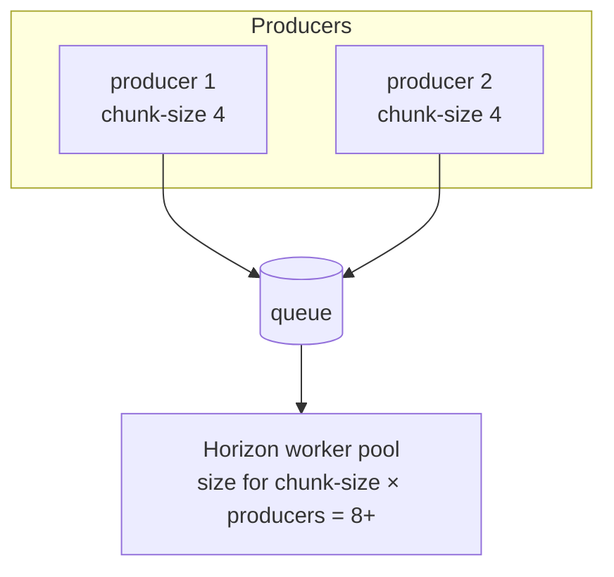

`LazyParallelBatch` and online monitoring both run work on Laravel queues. In
tests that means the `sync` driver or queue fakes; in production it means real
workers — Horizon being the documented path. This page is the operational
contract for getting that right.

## The shared cache store

Lazy-parallel collects queued sample outputs through a **cache-backed result
store**. The command process (the producer) and the queue workers must share the
**same** cache backend, or the producer cannot collect what the workers wrote:

```env
EVAL_HARNESS_BATCH_CACHE_STORE=redis
```

```mermaid
flowchart LR
    CMD["eval-harness:run (producer)"] -->|dispatch by index| Q[(Redis queue)]
    Q --> W1[Horizon worker] & W2[Horizon worker]
    W1 & W2 -->|write output[index]| RS[(Shared cache store<br/>Redis)]
    RS -->|read all indices| CMD
```

Use a durable, shared store (Redis) in production. The `array` driver is
in-memory per-process and works only for serial/in-process tests, never across
workers.

## The sync-driver timeout caveat

This is the single most important operational gotcha:

::: callout warning
**`--batch-timeout` and `--timeout` are wall-clock guarantees only on real
queue drivers** (Redis, database, beanstalk) where `dispatch()` returns
immediately. On the **`sync`** driver, `dispatch()` runs the job inline, so a
slow sample runs to completion regardless of the timeouts. The package sets the
job's `$timeout` property; Laravel's queue *workers* honor it, but `sync` has
no worker process to enforce it. **For any wall-clock guarantee, use a real
queue driver in production.**
:::

## Sizing workers for multiple producers

Worker pool demand does **not** scale with one producer's `--concurrency`. It
scales with the **effective in-flight limit per producer × the number of
concurrent producers**.

When `--chunk-size < --concurrency`, the producer waits for each chunk before
dispatching the next, so **chunk-size is the effective in-flight limit** per
producer process. If `K` eval commands run at the same time, peak in-flight
demand is roughly:

$$
\text{peak in-flight} \approx \text{chunk-size} \times K
$$



Size the Horizon worker pool for the **actual peak** (`chunk-size × concurrent
producers`), not for a single producer's chunk-size — otherwise the queue builds
a backlog. Worker counts themselves are configured in Horizon supervisors.

## The dispatch-budget diagnostic

`--batch-timeout` bounds **both** the dispatch phase (including any
`--rate-limit` pauses) **and** the result-collection phase. Two failure shapes:

- **Collection timeout** — the timeout fires before all queued outputs land; the
  command reports the **missing samples**.
- **Dispatch starvation** — a low `--rate-limit` consumes the whole budget before
  all samples are even dispatched; the command fails with an explicit *"chunk
  dispatch consumed the full … wait timeout"* diagnostic reporting how many
  samples were still undispatched.

Fix dispatch starvation by lowering `--chunk-size`, relaxing `--rate-limit`, or
raising `--batch-timeout`.

## Delayed external collection

Programmatic external `dispatch()` / `collectOutputs()` flows can keep result
metadata and outputs alive longer for delayed collection:

```php
use Padosoft\EvalHarness\Batches\BatchOptions;

$options = BatchOptions::lazyParallel(resultTtlSeconds: 7200);
```

## A production checklist

  ::: collapsible "Cache store"
`EVAL_HARNESS_BATCH_CACHE_STORE` points at a Redis store shared by the command
process and every worker.
:::
  ::: collapsible "Queue driver"
A real driver (Redis), never `sync`, so timeouts are enforced.
:::
  ::: collapsible "Horizon supervisors"
Worker pool sized for `chunk-size × concurrent producers`, on the queue you
pass to `--queue`.
:::
  ::: collapsible "Online monitoring queue"
`online.queue` / `online.connection` point at a Horizon-managed queue so live
judging never blocks the user request.
:::

For supervisor recipes and timeout-sizing tables, see
[`docs/HORIZON_BATCH_QUEUES.md`](https://github.com/padosoft/eval-harness/blob/main/docs/HORIZON_BATCH_QUEUES.md).

::: grids
::: grid
::: card "Batch execution" icon:layers
Profiles, backpressure, and the SUT rules.

[Open →](/operations/batch-execution)
:::
:::
::: grid
::: card "Online monitoring" icon:activity
The queued judge job for production traffic.

[Open →](/guides/online-monitoring)
:::
:::
:::

