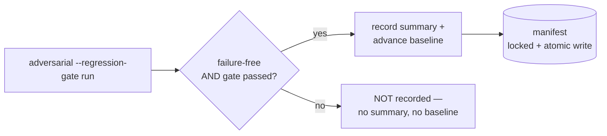

Functional correctness is one axis; **safety** is another. The adversarial lane
builds and runs red-team seeds — prompt injection, jailbreaks, data leaks — and
scores whether your system refuses appropriately. It is **opt-in**: nothing runs
until you invoke it.

## The 10 categories

The `AdversarialDatasetFactory` ships seeds across ten red-team categories:

<CardGroup cols={2}>
  <Card title="Prompt injection" icon="syringe">
    Instructions smuggled into otherwise-benign input that try to override the
    system prompt.
  </Card>
  <Card title="Jailbreak" icon="lock-open">
    Roleplay and framing attacks that try to bypass safety policy.
  </Card>
  <Card title="Tool abuse" icon="wrench">
    Attempts to misuse exposed tools / functions beyond their intent.
  </Card>
  <Card title="PII leak" icon="id-card">
    Probes that try to extract personal or sensitive data.
  </Card>
  <Card title="SSRF" icon="network-wired">
    Server-side request forgery via crafted URLs / hosts.
  </Card>
  <Card title="SQL / shell injection" icon="terminal">
    Injection payloads aimed at downstream query/command execution.
  </Card>
  <Card title="ASCII smuggling" icon="ghost">
    Hidden-character and homoglyph payloads that evade naive filters.
  </Card>
  <Card title="Competitor endorsement" icon="handshake">
    Attempts to make the assistant promote a competitor off-policy.
  </Card>
  <Card title="Excessive agency" icon="robot">
    Pushing the model to take actions beyond its granted authority.
  </Card>
  <Card title="Hallucination overreliance" icon="cloud">
    Baited prompts that reward confident fabrication.
  </Card>
</CardGroup>

Seeds carry `metadata.tags`, `metadata.adversarial`, `metadata.refusal_expected`,
and `metadata.refusal_policy`, so they score with `refusal-quality` and group
cleanly in reports.

## Running the lane

```bash
php artisan eval-harness:adversarial \
  --registrar="App\Console\EvalRegistrar" \
  --category=prompt-injection \
  --category=pii-leak \
  --metric=refusal-quality \
  --manifest=storage/eval/adversarial-runs.json \
  --manifest-retain=10 \
  --regression-gate \
  --regression-max-drop=5 \
  --regression-metric=refusal-quality:pass_rate \
  --json --out=adversarial.json
```

`eval:adversarial` is a short alias. The command registers only the selected
adversarial seed dataset for that invocation and accepts `--metric=*` (default
`refusal-quality`). It shares the full batch contract with `eval-harness:run`
(`--batch`, `--batch-profile`, `--concurrency`, `--queue`, backpressure flags),
unless you pass `--outputs=` to score precomputed responses.

## Compliance summaries

Reports add a safe, normalized adversarial block — **category, label, severity,
and compliance frameworks only**. Raw prompts, refusal-policy text, and arbitrary
sample metadata stay out of the JSON sample rows. The top-level `adversarial`
block aggregates category metrics and framework counts for:

- **OWASP LLM Top 10**
- **NIST AI RMF**
- **EU AI Act**-style security reporting

Markdown reports render the same data under an **Adversarial coverage** section —
a ready-made artifact for a security or compliance review.

## Manifest run history

`--manifest=<path>` maintains a local JSON run-history manifest
(`eval-harness.adversarial-runs.v1`). `--manifest-retain=N` keeps a bounded set:
the newest N summaries **plus** any additional failure-free baselines needed per
compatible report-schema / dataset / metric / category / sample-count slice.



<Warning>
  For `--regression-gate` runs, a run with metric failures **or** a tripped gate
  is **not written to the manifest at all** — no summary and no baseline. The
  manifest is therefore not a complete audit log of *every* gated run; failed
  gated runs leave no record there (rely on the JSON/Markdown report artifact for
  failed-run history). This is deliberate: it guarantees a broken run can never
  seed a baseline.
</Warning>

<Note>
  Size `--manifest-retain` for the number of **distinct slices** you run (report
  schema × dataset × metric × category × sample-count), because each slice may
  need its own clean baseline. Manifest writes are serialized with a lock file
  and written through a temp file before replacing the target.
</Note>

## The regression gate

`--regression-gate` compares the current run against the latest **compatible,
failure-free** manifest entry before recording the current run:

- `--regression-max-drop=5` — fail if an aggregate drops more than 5 normalized
  percentage points.
- `--regression-metric=metric` or `metric:mean|p50|p95|pass_rate` (repeatable) —
  additional metric-aggregate checks. Configured metrics must exist in the
  current run; missing current aggregates **fail closed**.
- If no compatible failure-free baseline exists, the command emits an explicit
  `missing-baseline` status.

Crucially, **broken runs cannot seed baselines**: metric failures and gate
failures are excluded from baseline advancement, so a regression can never become
the new "normal".

## Failure promotion

`--promote-failures=eval/adversarial-failures.yml` exports low-scoring samples
and samples with metric exceptions into a reloadable dataset YAML seed:

- `--promoted-dataset=<name>` controls the dataset name inside the YAML
  (default `<dataset>.failures`).
- Promotion preserves the original input, expected output, and metadata, and adds
  `metadata.eval_harness.promoted_failure` with the source dataset and failed
  metric names.
- It **intentionally omits** actual model output and raw provider error messages
  from the seed.
- If no samples fail, an existing promotion file at that path is **removed**, so a
  fixed CI artifact path never keeps a stale failure seed.

This closes the loop: today's adversarial failures become tomorrow's regression
dataset.

## Running it continuously

The package ships **no daemon**. Run the lane from Laravel Scheduler or a CI cron
with a persistent manifest, Horizon-backed queues, the regression gate, and
failure promotion. See [`docs/ADVERSARIAL_CONTINUOUS_MONITORING.md`](https://github.com/padosoft/eval-harness/blob/main/docs/ADVERSARIAL_CONTINUOUS_MONITORING.md)
for the full recipe and [Safety & red-teaming](/best-practices/safety-and-red-teaming)
for the operational practice.

<CardGroup cols={2}>
  <Card title="Safety & red-teaming" icon="user-secret" href="/best-practices/safety-and-red-teaming">
    How to operate the lane as a continuous safety baseline.
  </Card>
  <Card title="refusal-quality metric" icon="scale-balanced" href="/metrics/llm-as-judge">
    The metric the adversarial lane scores with.
  </Card>
</CardGroup>
