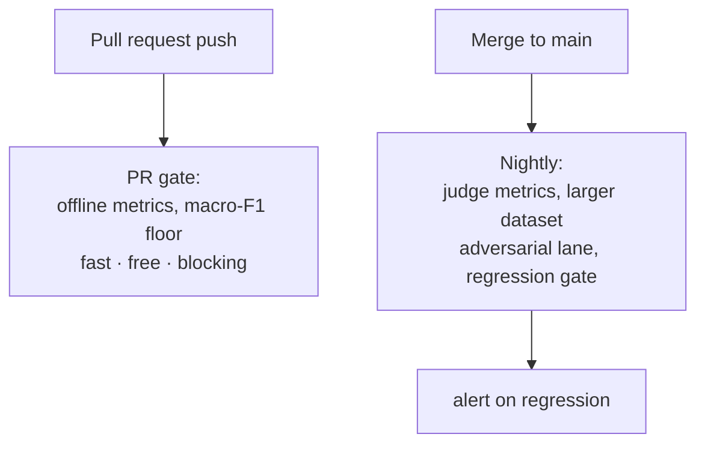

The whole point of eval-harness is this page: making the **exit code** of a run
block a bad merge the same way a failing PHPUnit test does.

## The exit-code contract

`eval-harness:run` translates the report into a process exit code:

| condition | exit code |
| --- | --- |
| every metric scored cleanly | `0` |
| any metric recorded a `SampleFailure` (provider/metric contract error) | non-zero |
| strict mode (`EVAL_HARNESS_RAISE_EXCEPTIONS=true`) hits the first `MetricException` | non-zero |

By default, **failures are captured, not fatal** — one timeout does not abort the
suite — but the captured failure still flips the exit code so CI fails. A strict
lane can opt into aborting on the first error.

<Note>
  The exit code reflects **execution health** (did every metric score), not a
  quality threshold by itself. To gate on a *quality bar* (e.g. macro-F1 ≥ 0.8),
  read the JSON report and assert on it — see [Gating on macro-F1](#gating-on-a-quality-threshold)
  below and [Regression gating](/best-practices/regression-gating).
</Note>

## A PR-safe workflow

Run the gate on the same events that change AI behavior — app code, config,
datasets, prompts:

```yaml
# .github/workflows/eval-gate.yml
name: AI Regression Gate

on:
  pull_request:
    paths:
      - 'app/**'
      - 'config/**'
      - 'eval/**'
      - 'resources/**'

jobs:
  eval-gate:
    runs-on: ubuntu-latest
    steps:
      - uses: actions/checkout@v4
      - uses: shivammathur/setup-php@v2
        with:
          php-version: '8.3'
          tools: composer:v2
      - name: Install dependencies
        run: composer install --no-interaction --prefer-dist --no-progress
      - name: Run eval gate
        env:
          EVAL_HARNESS_JUDGE_API_KEY: ${{ secrets.OPENAI_API_KEY }}
        run: |
          php artisan eval-harness:run rag.factuality.fy2026 \
            --registrar="App\\Console\\EvalRegistrar" \
            --json --out=eval-report.json
      - uses: actions/upload-artifact@v4
        if: always()
        with:
          name: eval-report
          path: eval-report.json
```

The `if: always()` on the upload step is deliberate — you want the report
**especially** when the gate fails, so the diff is one click away in the PR.

## Keep the gate fast and cheap

The PR gate runs on every push; it must be quick and ideally free.

<AccordionGroup>
  <Accordion title="Prefer offline metrics on the PR lane">
    `exact-match`, `contains`, `regex`, `rouge-l`, `citation-groundedness`,
    `ordinal-distance`, and the entire retrieval-ranking family need **no
    provider and no network**. A gate built from these costs nothing and runs in
    seconds.
  </Accordion>
  <Accordion title="Push expensive judges to a nightly lane">
    `llm-as-judge` and `refusal-quality` call a provider per sample. Keep them on
    a smaller nightly or release dataset, not the per-push PR gate.
  </Accordion>
  <Accordion title="Use a batch profile">
    `--batch-profile=ci` applies sane lazy-parallel defaults; `--batch-profile=smoke`
    stays serial for a fast pre-merge check. See
    [Batch execution](/operations/batch-execution).
  </Accordion>
</AccordionGroup>

## Gating on a quality threshold

The exit code catches execution failures. To also fail when *quality* drops below
a bar, read the JSON report's `macro_f1` and assert on it:

```bash
php artisan eval-harness:run rag.factuality.fy2026 \
  --registrar="App\\Console\\EvalRegistrar" \
  --json --out=eval-report.json

MACRO_F1=$(jq '.macro_f1' eval-report.json)
echo "macro-F1 = $MACRO_F1"
awk "BEGIN { exit !($MACRO_F1 >= 0.80) }" \
  || { echo "::error::macro-F1 $MACRO_F1 below 0.80 floor"; exit 1; }
```

For drift-relative gating (fail when the score drops more than N points from a
stored baseline) the adversarial lane ships a first-class `--regression-gate`;
see [Regression gating](/best-practices/regression-gating).

## What to gate, and where



<CardGroup cols={2}>
  <Card title="Regression gating" icon="chart-line-down" href="/best-practices/regression-gating">
    Baselines, manifests, and the adversarial regression gate.
  </Card>
  <Card title="Online monitoring" icon="wave-pulse" href="/guides/online-monitoring">
    Catch regressions the dataset never anticipated, in production.
  </Card>
</CardGroup>
