An LLM judge is a measuring instrument, and you do not gate production on an
uncalibrated instrument. **`eval-harness:calibrate-judge`** validates the judge
against human-labelled cases and fails the build when the judge cannot be
trusted — so an untrustworthy judge cannot silently rubber-stamp regressions.

## The methodology

Calibration asks one question: *does the judge's pass/fail verdict match the
human's?* It measures **verdict agreement**, not raw-score correlation — what
matters for a gate is whether the judge would have made the same accept/reject
decision a human would.

```mermaid
flowchart LR
    HC["Human-labelled cases<br/>(input, expected, actual, human_verdict)"] --> J[Judge each case]
    J --> V["judge score &#8594; verdict<br/>(verdict_pass_threshold)"]
    V --> CMP[compare to human_verdict]
    CMP --> AGR[agreement rate]
    CMP --> CM[confusion matrix]
    J --> LB[length-bias signal]
    J --> SP[self-preference guard]
    AGR & SP --> GATE{exit code}
```



## The calibration case file

A YAML file of cases a human has already judged:

```yaml
schema_version: eval-harness.calibration.v1
name: judge.calibration.fy2026
cases:
  - id: c1
    input: { question: "What is the capital of France?" }
    expected: "Paris"
    actual: "The capital of France is Paris."
    human_verdict: pass
  - id: c2
    input: { question: "What is the capital of France?" }
    expected: "Paris"
    actual: "It is Berlin."
    human_verdict: fail
```

Aim for a balanced set — comparable numbers of true-pass and true-fail cases,
including the hard, borderline ones where judges most often diverge from humans.

## Running it

```bash
php artisan eval-harness:calibrate-judge eval/calibration/judge-cases.v1.yaml \
  --min-agreement=0.85 \
  --model-under-test=my-rag-model \
  --json --out=judge-calibration.json
```

The command judges each case, converts the raw score into a verdict via
`verdict_pass_threshold`, and reports four things.

### 1. Verdict agreement rate

The fraction of cases where the judge's verdict equals the human's. This is the
headline number, gated by `--min-agreement` (config `min_agreement`, default
`0.8`). Below the floor, the command **exits non-zero**.

### 2. Confusion matrix

The full breakdown of agreements and disagreements:

| | human: pass | human: fail |
| --- | --- | --- |
| **judge: pass** | true pass | **false pass** |
| **judge: fail** | **false fail** | true fail |

The asymmetry matters. A judge with many **false passes** lets regressions
through (dangerous for a gate); many **false fails** block good changes
(annoying, but safe). The matrix tells you which way your judge errs.

### 3. Length-bias signal

The **Spearman rank correlation** between answer length and judge score. A high
positive correlation suggests the judge rewards verbosity rather than
correctness. Crossing `length_bias_warn` (default `0.4`) emits a **warning** —
non-fatal, but a flag that your judge may be gameable by padding.

### 4. Self-preference guard

Models rate their own outputs higher. When `require_distinct_models` is on (the
default) the command **fails closed** if the judge model equals
`--model-under-test`. Never let a model grade itself.

## The gate semantics

<AccordionGroup>
  <Accordion title="Exit non-zero (build fails)">
    Verdict agreement is below `--min-agreement`, **or** the judge model equals
    the model under test (self-preference violation).
  </Accordion>
  <Accordion title="Warn (non-fatal)">
    Length bias is suspected — the length/score correlation crosses
    `length_bias_warn`.
  </Accordion>
  <Accordion title="Pass">
    Agreement meets the floor, judge and model under test are distinct, and
    length bias is within tolerance.
  </Accordion>
</AccordionGroup>

<Tip>
  Run calibration **before** you trust a new judge model in CI, and re-run it
  whenever you change the judge model or prompt template. A judge swap is exactly
  the kind of silent change that motivates this whole package — calibrate it like
  you would test any other instrument.
</Tip>

<CardGroup cols={2}>
  <Card title="LLM-as-judge metrics" icon="scale-balanced" href="/metrics/llm-as-judge">
    The judge metrics calibration protects.
  </Card>
  <Card title="Trustworthy judges" icon="user-shield" href="/best-practices/trustworthy-judges">
    Operational practice for keeping judges honest over time.
  </Card>
</CardGroup>
