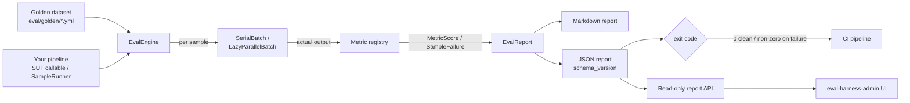

## What eval-harness is

**`padosoft/eval-harness` is a Laravel-native evaluation framework for RAG and
LLM applications.** It gives the non-deterministic part of your stack — the
retriever, the prompt, the model, the chunker — the same regression protection
your business logic has had for fifteen years: a curated golden dataset, a set
of declared metrics, and a CI gate that exits non-zero the moment quality
drops.

It runs **inside your application container**, resolving your real Laravel
services directly. Datasets are **YAML** (reviewable in pull requests), reports
are **JSON + Markdown** (diffable artifacts), and every external call goes
through Laravel's `Http::` facade so the entire offline path is deterministic
and free.

<Note>
  Your PHPUnit suite green-lights a deploy because it does not know what a
  *correct answer* looks like. Bump an embedding model, swap `gpt-4o` for
  `gpt-4o-mini`, tweak a prompt template, or change the chunker, and every one
  of those is a silent quality-regression risk with **no programmatic signal**.
  eval-harness closes that loop: a golden dataset plus a macro-F1 gate turns
  "we have AI in prod" into "we have a regression test for our AI in prod".
</Note>

## How it fits together

## The differentiators

These are the things no other public evaluation tool ships in a single
Laravel-native package. Each links to the page that explains the theory, the
design, and the rationale in depth.

<CardGroup cols={2}>
  <Card title="Fifteen metrics out of the box" icon="function" href="/metrics/overview">
    Lexical, structural, semantic, LLM-as-judge, ordinal, citation-groundedness,
    and the full retrieval-ranking family (hit@k / recall@k / MRR / nDCG@k /
    containment) behind a clean `Metric` interface.
  </Card>
  <Card title="Trustworthy LLM judges" icon="scale-balanced" href="/guides/judge-calibration">
    Calibrate the judge against human labels before you gate on it: verdict
    agreement rate, a confusion matrix, a length-bias signal, and a
    self-preference guard that fails when the judge equals the model under test.
  </Card>
  <Card title="Production online monitoring" icon="wave-pulse" href="/guides/online-monitoring">
    Sample live AI traffic, judge it on a queue, chart pass-rate drift, and fire
    an <code>OnlinePassRateDropped</code> event when recent quality dips below
    threshold. Off by default; Horizon-ready.
  </Card>
  <Card title="Adversarial red-team lane" icon="shield-halved" href="/guides/adversarial-testing">
    Opt-in safety regression seeds across 10 categories, OWASP&nbsp;LLM /
    NIST&nbsp;AI&nbsp;RMF / EU&nbsp;AI&nbsp;Act compliance summaries, a manifest
    regression gate, and failure-promotion back to reusable datasets.
  </Card>
  <Card title="Queue / Horizon batch execution" icon="layer-group" href="/operations/batch-execution">
    Deterministic <code>SerialBatch</code> by default, or queue-backed
    <code>LazyParallelBatch</code> with operational profiles, producer-side
    backpressure, and progress checkpoints.
  </Card>
  <Card title="Local-first, no lock-in" icon="lock-open" href="/installation">
    YAML datasets, JSON/Markdown reports, a single optional migration, any
    OpenAI-compatible provider via <code>Http::</code>. Apache-2.0, headless,
    provider-agnostic.
  </Card>
</CardGroup>

## Who it is for

- **Laravel engineering teams** with a RAG or LLM feature in production and no
  programmatic quality signal on model / prompt / retriever changes.
- **Platform & MLOps owners** who want a CI gate, nightly safety baselines, and
  a pass-rate-over-time dashboard without adopting a hosted Python platform.
- **Regulated-industry operators** who need refusal-quality scoring, adversarial
  coverage, and compliance-framework summaries (OWASP / NIST / EU AI Act).
- **Anyone allergic to vendor lock-in** who wants offline-deterministic,
  diffable evaluation artifacts they own.

## Where to go next

<CardGroup cols={3}>
  <Card title="Quickstart" icon="bolt" href="/quickstart">
    Curate a dataset, wire a registrar, and gate your first run in five minutes.
  </Card>
  <Card title="Core concepts" icon="diagram-project" href="/core-concepts">
    Datasets, samples, metrics, the SUT, reports, macro-F1, cohorts, and gates.
  </Card>
  <Card title="Architecture" icon="sitemap" href="/architecture/overview">
    The engine, the batch layer, the metric registry, and the report contract.
  </Card>
</CardGroup>
