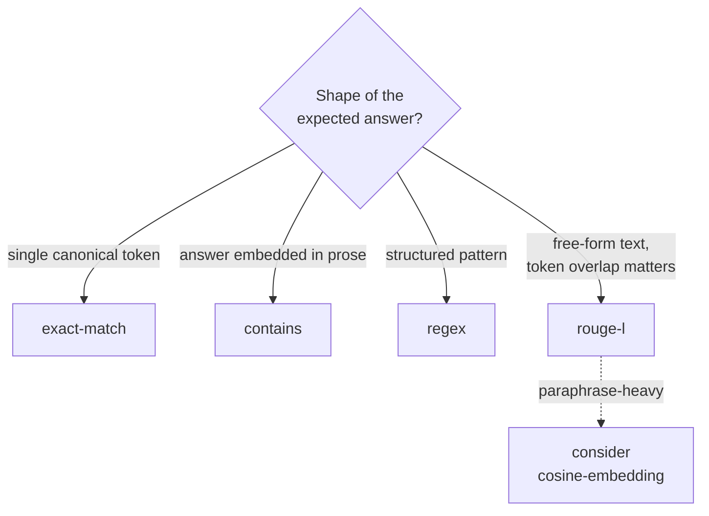

These four metrics are **exact, deterministic, and free**: no provider, no
network, no randomness. They are the backbone of a fast PR gate because they run
in milliseconds and never cost an API call.

## exact-match

**Strict, case-sensitive, byte-for-byte** string equality — `===`, with **no**
normalization. Whitespace, case, and punctuation are all significant:

$$
\text{exact-match}(e, a) = \begin{cases} 1.0 & \text{if } a = e \text{ (exact bytes)} \\ 0.0 & \text{otherwise} \end{cases}
$$

(The sample's `expected_output` must be a string, or the metric raises a
`MetricException`.) Use it when the expected output is a single canonical token —
an id, a date, a country, a yes/no — where any deviation is wrong.

<Warning>
  Exact-match does **not** trim or case-fold. `"Paris."`, `"paris"`, and
  `"Paris "` (trailing space) all score `0.0` against `"Paris"`. If you need
  tolerance for case/whitespace/punctuation, normalize in your SUT before
  returning, use `contains`/`regex`, or reach for a semantic metric — do not
  expect exact-match to absorb it.
</Warning>

## contains

Substring membership — `1.0` if the expected string appears anywhere inside the
actual output, else `0.0`. The right choice when the model wraps the right
answer in a sentence:

> *"The capital of France is **Paris**, a city of about 2.1 million."*

`contains("Paris")` scores `1.0` here where `exact-match` would score `0.0`.

## regex

Pattern membership — `1.0` if the actual output matches the expected regular
expression, else `0.0`. Use it for structured-but-variable outputs: an order id
shape (`/ORD-\d{6}/`), an ISO date, a currency amount, a refusal phrase family.

```yaml
samples:
  - id: order-id-shape
    input: { question: "Give me a sample order id." }
    expected_output: '/^ORD-\d{6}$/'
    metadata: { tags: [format] }
```

## rouge-l

**ROUGE-L** (Lin, 2004) scores overlap by the **Longest Common Subsequence**
(LCS) between the expected and actual token sequences. Unlike n-gram overlap,
LCS rewards in-order matches without requiring contiguity, so it tolerates
insertions and reordering of unrelated words.

Let $X$ be the reference of length $m$ and $Y$ the candidate of length $n$, and
let $\mathrm{LCS}(X, Y)$ be the length of their longest common subsequence.
Define recall, precision, and the combined F-measure:

$$
R_{lcs} = \frac{\mathrm{LCS}(X, Y)}{m}, \qquad
P_{lcs} = \frac{\mathrm{LCS}(X, Y)}{n}
$$

$$
F_{lcs} = \frac{(1 + \beta^2)\, R_{lcs}\, P_{lcs}}{R_{lcs} + \beta^2 P_{lcs}}
$$

The metric returns $F_{lcs} \in [0, 1]$. Intuitively: how much of the reference's
ordered content survives in the candidate, balanced against how much of the
candidate is on-topic. ROUGE-L is the standard surface-overlap metric for
summarization and long-form answers where semantic metrics may be overkill.

<Note>
  ROUGE-L measures **surface** overlap, not meaning. Two correct paraphrases
  that share few tokens score low. When paraphrase tolerance matters, reach for
  [semantic similarity](/metrics/semantic-similarity) instead — or run both and
  read them as complementary signals.
</Note>

## When to use which



## Worked example

```yaml
schema_version: eval-harness.dataset.v1
name: support.faq.lexical
samples:
  - id: refund-window
    input: { question: "Return window?" }
    expected_output: "30 days"
    metadata: { tags: [policy] }
```

```php
$engine->dataset('support.faq.lexical')
    ->loadFromYaml(base_path('eval/golden/support-faq.yml'))
    ->withMetrics(['contains', 'rouge-l'])
    ->register();
```

A model answering *"You have 30 days from delivery to return an order."* scores
`1.0` on `contains` and a high `rouge-l` — the policy fact is present and the
phrasing overlaps the reference.

<CardGroup cols={2}>
  <Card title="Semantic similarity" icon="vector-square" href="/metrics/semantic-similarity">
    When surface overlap is too brittle for paraphrase.
  </Card>
  <Card title="Aggregation & macro-F1" icon="sigma" href="/metrics/ordinal-and-aggregation">
    How these scores roll up into the headline gate number.
  </Card>
</CardGroup>
