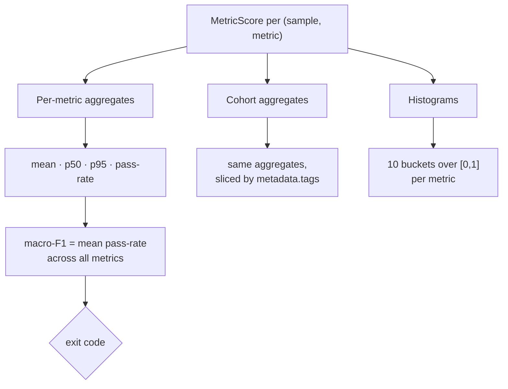

This page covers the last two metrics — `ordinal-distance` and
`citation-groundedness` — and then the **aggregation layer** that turns
thousands of individual scores into the handful of numbers a gate actually
reads.

## ordinal-distance

Exact-match is all-or-nothing, which is wrong for **ordered** labels. If the
gold label is `high` and the model says `urgent`, that is a near miss; saying
`low` is a serious error. `ordinal-distance` gives **graded partial credit** by
the distance between positions on an ordered scale.

Given an ordered scale $S = (s_0, s_1, \dots, s_{n-1})$ with the expected label
at index $i$ and the actual at index $j$:

$$
\text{ordinal-distance} = \begin{cases}
1.0 & |i - j| = 0 \\
0.5 & |i - j| = 1 \\
0.0 & |i - j| \ge 2
\end{cases}
$$

The metric needs the scale, so pass an instance:

```php
use Padosoft\EvalHarness\Metrics\OrdinalDistanceMetric;

$engine->dataset('triage.severity')->withMetrics([
    new OrdinalDistanceMetric(['low', 'medium', 'high', 'urgent']),
]);
```

Exact = `1.0`, off-by-one = `0.5`, further = `0.0`. Use it for severity triage,
sentiment buckets, priority levels — anywhere "close" deserves more than zero.

## citation-groundedness

Scores whether an answer actually **cites its evidence**. It has two modes.

**Marker mode (baseline).** `metadata.citations` (a string or a list of strings)
declares the citation markers that should appear (e.g. `[1]`, `[source:refunds]`).
The score is the **fraction** of required markers present in the actual output —
`matched / required` — so two of three expected markers scores `0.667`, not a flat
pass/fail:

```yaml
samples:
  - id: cited-answer
    input: { question: "What is the refund window?" }
    expected_output: "Refunds are available within 30 days."
    metadata:
      citations: ["[policy:refunds]"]   # markers live in metadata, not expected_output
```

**Evidence mode (strict).** `metadata.citation_evidence` declares spans that each
require **both** a citation marker **and** the quoted evidence text (and the score
is the fraction of spans fully matched):

```yaml
metadata:
  citation_evidence:
    - citation: "[policy:refunds]"
      quote: "Refunds are available within 30 days."
```

Each span scores only when the actual output contains both the marker and the
quote. This is the metric for "no ungrounded claims" gates.

<Note>
  Report details for citation-groundedness expose **counts only** — never the
  raw citation strings or quote text. Evidence content stays out of the report
  contract by design, so reports remain safe to publish as CI artifacts.
</Note>

## Aggregation: from scores to a gate

Every metric emits one `MetricScore` per sample. The `EvalReport` aggregates
them along three axes.



### Pass-rate

A sample **passes** a metric when its score is $\ge 0.5$. The per-metric
pass-rate is the fraction of samples that pass:

$$
\text{pass-rate}(m) = \frac{1}{|N|} \sum_{s \in N} \mathbb{1}\!\left[\text{score}_m(s) \ge 0.5\right]
$$

### Macro-F1

The headline gate number. It is the **average pass-rate across all metrics** —
"macro" because each metric contributes equally regardless of how it scores:

$$
\text{macro-F1} = \frac{1}{|M|} \sum_{m \in M} \text{pass-rate}(m)
$$

Equal weighting is deliberate: a cheap `exact-match` and an expensive
`llm-as-judge` each get one vote, so no single metric can dominate the gate.

### Percentiles

Means hide tails. The report also reports **p50** (median) and **p95** per
metric. A metric with mean `0.85` but p95 `0.30` has a cluster of bad samples
the mean smooths over — the percentiles expose it.

### Cohorts

Every aggregate is also computed **per cohort**, sliced by `metadata.tags`. A
multi-tag sample appears in each of its cohorts; samples with no tags fall into
an explicit **untagged** bucket. Cohorts answer *"the overall score held, but did
the `policy` questions regress?"*

### Histograms

Per metric, scores are bucketed into ten bins over $[0, 1]$ (zero-count buckets
included) so a dashboard can chart the distribution shape — bimodal, skewed,
clustered — not just the mean.

## A complete report at a glance

```
## Per-metric aggregates
| metric           | mean   | p50    | p95    | pass-rate (>= 0.5) |
| exact-match      | 0.7333 | 1.0000 | 1.0000 | 0.7333             |
| cosine-embedding | 0.9012 | 0.9421 | 0.9893 | 0.9667             |

## Macro-F1 (avg pass-rate across all metrics): 0.8500

## Cohorts by metadata.tags
| cohort     | samples | metric      | mean   | pass-rate |
| geography  | 12      | exact-match | 0.9500 | 0.9500    |
| policy     | 8       | exact-match | 0.6000 | 0.6000    |
```

Here the macro-F1 of `0.85` is healthy, but the `policy` cohort's `0.60`
pass-rate is the regression to chase — visible only because the dataset tagged
its samples.

<CardGroup cols={2}>
  <Card title="Regression gating" icon="traffic-light" href="/best-practices/regression-gating">
    Turning macro-F1 and cohorts into a merge gate.
  </Card>
  <Card title="Report contract" icon="file-code" href="/architecture/report-contract">
    The exact JSON shape these aggregates serialize to.
  </Card>
</CardGroup>
