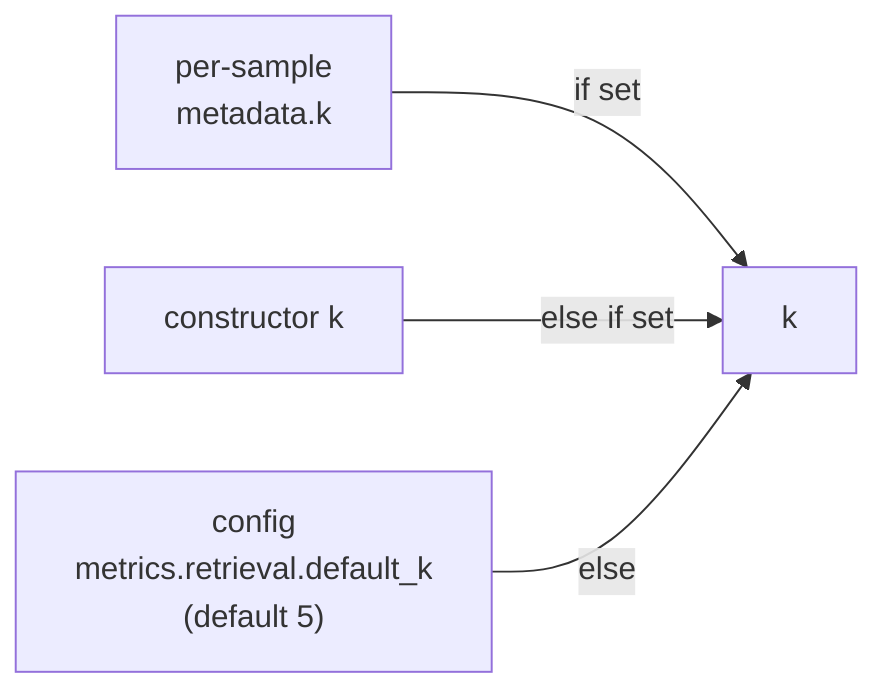

A RAG system has two halves: a **retriever** that ranks documents and a
**generator** that answers from them. If the right document never makes the
top-k, no prompt engineering can save the answer. The retrieval-ranking family
scores the retriever in isolation, using the classical metrics of
**information retrieval**.

The math is **domain-agnostic**: it consumes a ranked list of opaque ids (and,
for containment, texts) plus the relevant ground truth, and returns a number in
$[0, 1]$. Running the retriever stays in your app; the package owns the
easy-to-get-wrong ranking math as a single tested source of truth.

## The input contract

Your SUT emits `actualOutput` as JSON — an **ordered** list, rank 1 first:

```json
{"retrieved": [{"id": "doc-7", "text": "..."}, {"id": "doc-3", "text": "..."}]}
```

A bare array (`["doc-7", "doc-3"]`) is also accepted. The sample's
`expected_output` is the relevant ground truth — either **binary** relevance (a
list of relevant ids) or **graded** gains (an id → gain map, used by nDCG):

```yaml
samples:
  - id: q-1
    input: { question: "What is our refund window?" }
    expected_output: ["doc-3", "doc-9"]        # binary relevance
    metadata: { k: 5 }                          # optional per-sample cutoff
  - id: q-2
    input: { question: "..." }
    expected_output: { "doc-3": 3, "doc-9": 1 } # graded gains
```

### How `k` resolves

The cutoff $k$ is resolved in precedence order:



## The metrics

Let the ranked result list be $D = (d_1, d_2, \dots)$ where $d_i$ is the id at
rank $i$, and let $\mathrm{Rel}$ be the set of relevant ids. Let $D_k$ be the
top-$k$ prefix.

### hit@k

Did *any* relevant document make the top-k? A binary success signal.

$$
\text{hit@}k = \begin{cases} 1.0 & \text{if } D_k \cap \mathrm{Rel} \neq \varnothing \\ 0.0 & \text{otherwise} \end{cases}
$$

### recall@k

What *fraction* of all relevant documents made the top-k? The completeness of
retrieval.

$$
\text{recall@}k = \frac{|D_k \cap \mathrm{Rel}|}{|\mathrm{Rel}|}
$$

### MRR (mean reciprocal rank)

How high did the *first* relevant document rank? Reciprocal rank rewards getting
a relevant hit early; it is cutoff-independent in spirit (a later hit is worth
less). For a single query with first relevant document at rank $r$:

$$
\text{RR} = \frac{1}{r}, \qquad \text{RR} = 0 \text{ if no relevant document is retrieved}
$$

Averaged across the dataset this is the familiar
$\text{MRR} = \frac{1}{|Q|}\sum_{q \in Q} \frac{1}{r_q}$. A first-hit at rank 1
scores `1.0`, rank 2 scores `0.5`, rank 4 scores `0.25`.

### nDCG@k (normalized discounted cumulative gain)

The richest ranking metric: it rewards placing **highly relevant** documents
**high** in the list, with a logarithmic positional discount. It supports
**graded** gains, so "very relevant" beats "somewhat relevant".

Discounted Cumulative Gain at $k$, with gain $g_i$ for the document at rank $i$:

$$
\text{DCG@}k = \sum_{i=1}^{k} \frac{2^{g_i} - 1}{\log_2(i + 1)}
$$

Normalize by the **ideal** DCG (the same gains sorted into their best possible
order) to get a $[0, 1]$ score comparable across queries:

$$
\text{nDCG@}k = \frac{\text{DCG@}k}{\text{IDCG@}k}
$$

With binary relevance, $g_i \in \{0, 1\}$ and the numerator reduces to
$\frac{1}{\log_2(i+1)}$ for each relevant hit. The $\log_2$ discount encodes the
intuition that the gap between rank 1 and rank 2 matters far more than the gap
between rank 19 and rank 20.

### answer-containment@k

An end-to-end reachability check: does the expected answer span actually appear
in the **text** of any top-k retrieved document?

$$
\text{containment@}k = \begin{cases} 1.0 & \text{if expected answer} \subseteq \text{text}(d_i) \text{ for some } d_i \in D_k \\ 0.0 & \text{otherwise} \end{cases}
$$

This bridges retrieval and generation: even with perfect ranking ids, if the
answer text is not present in the retrieved passages, the generator cannot ground
its answer. Containment catches that.

## A worked comparison

Consider $\mathrm{Rel} = \{\texttt{doc-3}, \texttt{doc-9}\}$, $k = 5$, and a
retriever returning `[doc-7, doc-3, doc-1, doc-9, doc-2]`:

| metric | value | reasoning |
| --- | --- | --- |
| `hit@5` | `1.0` | `doc-3` is in the top-5 |
| `recall@5` | `1.0` | both relevant ids are in the top-5 |
| `retrieval-mrr` | `0.5` | first relevant (`doc-3`) is at rank 2 → $1/2$ |
| `nDCG@5` (binary) | `≈ 0.70` | hits at ranks 2 and 4, discounted vs the ideal ranks 1 and 2 |

The same retriever is *complete* (recall 1.0) but *poorly ordered* (MRR 0.5,
nDCG 0.70) — exactly the diagnostic split these metrics are designed to surface.

## Registering them

The retrieval aliases and `answer-containment-at-k` auto-wire from the container
with zero extra binding:

```php
$engine->dataset('rag.retrieval')->withMetrics([
    'retrieval-hit-at-k',
    'retrieval-recall-at-k',
    'retrieval-mrr',
    'retrieval-ndcg-at-k',
    'answer-containment-at-k',
]);
```

<Tip>
  Run `recall@k` and `nDCG@k` together. Recall tells you *whether* the right
  documents are retrieved at all; nDCG tells you whether they are *ranked well*.
  A regression that drops nDCG while holding recall is a re-ranking bug, not a
  retrieval-coverage bug — and you want to know which.
</Tip>

<CardGroup cols={2}>
  <Card title="Semantic similarity" icon="vector-square" href="/metrics/semantic-similarity">
    Scoring the generator half once retrieval is sound.
  </Card>
  <Card title="Metrics catalog" icon="table-list" href="/reference/metrics-catalog">
    Every retrieval alias, its inputs, and the k knob.
  </Card>
</CardGroup>
