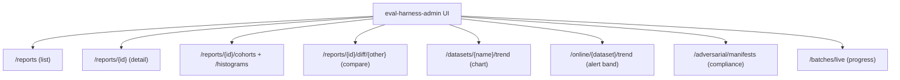

The package can register **opt-in, read-only** routes so a separate Laravel
admin/UI package can consume stored report artifacts. It is **disabled by
default** because the package bundles no authentication.

## Enabling it

```php
// config/eval-harness.php
'api' => [
    'enabled' => true,
    'prefix' => 'admin/eval-harness/api',
    'middleware' => ['web', 'auth'],
    'trend' => [
        'max_files_scanned' => 5000,
    ],
],
```

<Warning>
  The `middleware` stack **must** authenticate. This package ships no auth; mount
  the API only behind your host app's existing admin gate. The default prefix is
  `eval-harness/api`.
</Warning>

## The response envelope

Every JSON response carries a version discriminator:

```json
{
  "schema_version": "eval-harness.report-api.v1",
  "data": { ... }
}
```

Individual endpoints add their own sub-schema discriminators (e.g.
`eval-harness.report-api.v1.trend`). Errors use standard codes: `404` (missing
artifact / id), `422` (malformed JSON on a JSON-only endpoint), `503`
(disk/cache read failure).

## Endpoint catalog

All paths are relative to the configured prefix.

### Reports

| Endpoint | Purpose |
| --- | --- |
| `GET /reports` | List JSON/Markdown report artifacts on the reports disk. |
| `GET /reports/{id}` | Show one artifact by URL-safe id. |
| `GET /reports/{id}/cohorts` | Cohort summaries for a report (JSON). |
| `GET /reports/{id}/histograms` | Per-metric score distribution buckets (JSON). |
| `GET /reports/{id}/rows.csv` | Sample-by-metric rows as CSV (`sample_id`, `tags`, `metric`, `score`, `error`, `details`). |
| `GET /reports/{id}/download` | Direct artifact download (`.json` / `.md`). |
| `GET /reports/{id}/diff/{otherId}` | Signed deltas between two reports. |

The **diff** endpoint computes `macro_f1` delta, per-metric mean/pass-rate deltas,
per-cohort status (`added` / `removed` / `regressed` / `improved` / `stable`),
`total_samples` / `total_failures` deltas, and adversarial categories when
present — so a UI can show a regression side-by-side without fetching both full
reports.

### Trends

| Endpoint | Purpose |
| --- | --- |
| `GET /datasets/{name}/trend?limit=N` | Chronological points for one dataset (macro-F1, per-metric mean/pass-rate, usage). |
| `GET /online/{dataset}/trend?limit=N` | Production pass-rate-over-time points plus the configured alert `threshold`. |

The dataset trend scans stored JSON reports, skips malformed artifacts, caps
`limit` at 100, and caps scanned files via `api.trend.max_files_scanned`. The
online trend feeds the [online-monitoring](/guides/online-monitoring) dashboard's
alert band.

### Adversarial manifests

| Endpoint | Purpose |
| --- | --- |
| `GET /adversarial/manifests` | Enumerate adversarial run manifests on the configured disk. |
| `GET /adversarial/manifests/{name}` | Show one manifest + its run history. |

Opt-in via `eval-harness.adversarial.manifests.{disk,path_prefix}`, so a UI can
browse compliance history without scraping the filesystem. The CLI
`--manifest=<path>` flag remains independent.

### Live batches

| Endpoint | Purpose |
| --- | --- |
| `GET /batches/live` | Active lazy-parallel batch ids + status. |
| `GET /batches/{id}/progress` | Compact progress counters for one batch. |

Enabled by default; disable via `eval-harness.batches.live_registry.enabled`.

## How a UI composes them



Every endpoint is optional — a UI degrades gracefully if a given surface is
disabled. The full JSON examples and contract notes live in
[`docs/REPORT_API_CONTRACT.md`](https://github.com/padosoft/eval-harness/blob/main/docs/REPORT_API_CONTRACT.md);
the companion UI spec is in
[`docs/UI_PACKAGE_SPEC.md`](https://github.com/padosoft/eval-harness/blob/main/docs/UI_PACKAGE_SPEC.md).

## The companion UI package

A ready-made dashboard ships separately as
[`padosoft/eval-harness-admin`](https://github.com/padosoft/eval-harness-admin):
Dashboard, Reports list, Report detail, Compare, Trend, Adversarial manifests, and
Live batches — all built on the contracts above, with authentication delegated to
the host app.

<CardGroup cols={2}>
  <Card title="Report contract" icon="file-code" href="/architecture/report-contract">
    The JSON shape these endpoints serve.
  </Card>
  <Card title="Online monitoring" icon="wave-pulse" href="/guides/online-monitoring">
    The trend endpoint in context.
  </Card>
</CardGroup>
